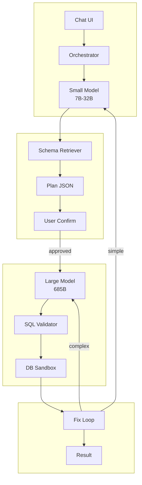

# Agent Architecture Patterns

This document outlines high-performance architecture patterns for building enterprise-grade AI agents, focusing on cost-efficiency, latency reduction, and reliability.

## 1. Hybrid Architecture: Heavy Reasoning Model + Small Specialist (For SQL / ETL)

### 🎯 Core Objective
The goal is to treat the **Large Model (e.g., 685B parameter models)** as a scarce, expensive "Reasoning Core", while offloading high-frequency, low-entropy, and structured tasks to **Small Models (7B~32B), Rules, or Heuristics**.

This strategy significantly reduces:
1.  **Call Frequency** to the large model.
2.  **Context Length** per call (by filtering noise upstream).
3.  **Prefill Latency** (the most expensive part of long-context inference).

---

### 🏗️ Architecture Diagram

### 🧠 Key Strategies

#### 1. "Schema-aware Plan" on the Edge (Small Model)
**Anti-Pattern**: Dumping the entire 500-table schema into the 685B model's context for every query.
*   **Strategy**: Use a Small Model + Retriever (RAG) to generate a lightweight `Plan JSON`. This plan contains only the *relevant* top-K tables and field suggestions.
*   **Impact**: The large model only sees a highly filtered, semantic subset of the schema. This **avoids prefilling 40k+ tokens** for every turn, which is the primary bottleneck in high-throughput systems.

#### 2. "Confirm then Execute" (Human-in-the-Loop)
**Anti-Pattern**: "Fire and Forget" complex queries which leads to expensive regeneration loops when the intent is misunderstood.
*   **Strategy**: Placing the "User Confirmation" step *after* the planning phase but *before* the heavy SQL generation. The user reviews the `Plan Draft`. Only upon "Proceed" is the sanitized context sent to the 685B model.
*   **Impact**: Eliminates invalid calls caused by ambiguous requirements, acting as a gatekeeper for the expensive compute resource.

#### 3. Tiered Error Correction Loop (L1/L2 Support)
**Anti-Pattern**: Using the 685B model to fix simple syntax errors or typos.
*   **Strategy**:
    *   **Tier 1 (90% of errors)**: Syntax typos, wrong column names, simple type mismatches.
        *   *Handler*: **Small Model (CodeLLaMA, DeepSeek-Coder-33B)** reading the Error Log.
    *   **Tier 2 (10% of errors)**: Logic flaws, wrong window functions, misunderstanding business rules.
        *   *Handler*: **Escalate to Large Model (685B)**.
*   **Impact**: Drastically lowers average cost per successful query.

---

### 🚀 Immediate Implementation Steps

1.  **Concurrency Throttling**:
    Reduce the concurrency limit for the **Large Model** specific path from ~20 to **2~4 per replica**. Long-context prefill is compute-intensive; high concurrency causes "invisible congestion" (KV cache thrashing and attention latency).
2.  **Schema Pre-processing**:
    Decouple the "Table Selection" task. Move it entirely to a Small Model pipeline. Ensure the Large Model never sees the full raw schema database, only the refined selection.

These two changes typically resolve the "no queue but high latency" phenomenon in production ETL agents.
