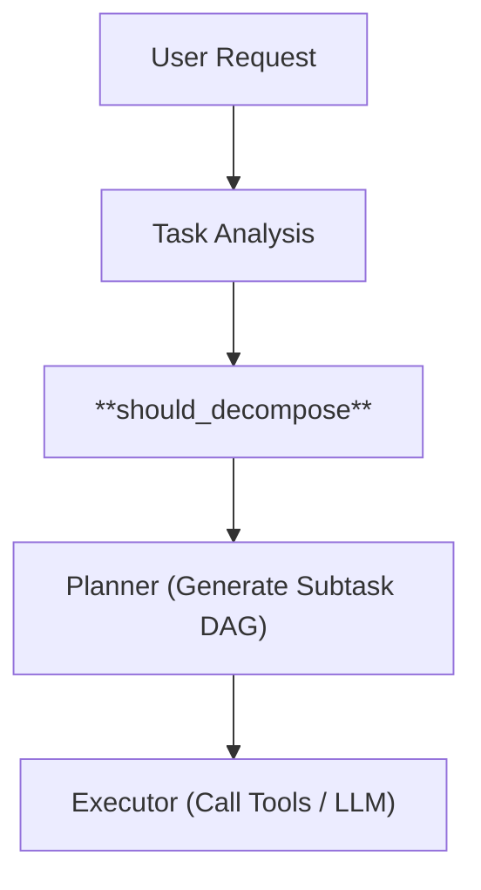

# Agent Development FAQ

> Comprehensive answers to questions about AI Agent development, covering decision logic, tool selection, task decomposition, memory systems, and engineering implementation.

**What's Inside**: This FAQ systematically covers the full lifecycle of AI Agent development—from theory to production. Topics include: how Agents determine whether tasks need decomposition and quantitative complexity thresholds (with engineering approaches vs. LLM black-box trade-offs); multi-stage tool selection mechanisms (semantic matching, rule-based filtering, contextual ranking) along with failure retry and self-correction strategies; DAG-based task decomposition, dependency management, dynamic replanning, and rollback mechanisms; short-term vs. long-term memory architecture, vector database storage/retrieval optimization, and critical data retention policies; multi-task concurrency scheduling, resource contention, and memory isolation; stability risks in long-running scenarios (decision bias, vector index degradation) with monitoring solutions; ambiguous requirement handling (proactive assumptions vs. structured clarification); framework comparisons (LangChain, AutoGen, LlamaIndex) and layered custom implementations; and the practical simplifications made when applying theoretical methods (CoT, ReAct) in production. A core theme throughout: **mature systems should engineer scheduling logic explicitly, rather than relying entirely on LLM black boxes**.

## 1. Basic Understanding & Decision Logic

### 1. How does an Agent determine if a task needs decomposition?

Agents use a multi-stage decision process combining **complexity analysis** and **capability matching**:

**Decision Framework:**
1. **Complexity Assessment**: Analyze input characteristics (token count, semantic ambiguity, number of sub-requirements)
2. **Capability Evaluation**: Match against known tool capabilities and success patterns
3. **Resource Estimation**: Predict computational cost and failure probability

**Implementation Approach:**
```python
def should_decompose(task, available_tools):
    complexity_score = calculate_complexity(task)
    capability_match = find_best_tool_match(task, available_tools)
    
    if complexity_score > DECOMPOSITION_THRESHOLD:
        return True
    if capability_match.confidence < TOOL_CONFIDENCE_THRESHOLD:
        return True
    if task.requires_multiple_tool_types():
        return True
    return False
```

**Key Indicators for Decomposition:**
- Multiple distinct objectives in single request
- Ambiguous or conflicting requirements
- No single tool provides adequate coverage
- High failure rate in similar historical tasks

**Deep Dive: Is this logic an LLM Black Box?**

**Conclusion:**
👉 **Not necessarily.**
👉 Moreover, in a "mature system", it **should not** be entirely an LLM black box.

**1. Component Analysis: Where should LLMs be used?**

**A. `calculate_complexity(task)`**
Two implementation routes:
*   ❌ **Black Box Approach (Not Recommended)**: Asking LLM "Please judge the complexity of this task, return 0–1".
    *   **Issues**: Unstable, unexplainable, cannot be tuned.
*   ✅ **Engineering Approach (Recommended)**:
    ```python
    complexity = w1 * token_length + w2 * constraint_count + w3 * step_keywords + w4 * ambiguity_score
    ```
    *   👉 **Rule + Statistics**
    *   👉 **Explainable**
    *   👉 **Tunable thresholds**
    *   **LLM Role**: Can assist in data annotation or identifying "multi-step" features, but **does not directly make the final judgment**.

**B. `find_best_tool_match(...)`**
This is the core of the Agent system and should not be a pure black box.
*   **Common Structure**:
    `Task` → `Embedding / Keyword / Schema Match` → `Top-K Candidate Tools` → `LLM / Scorer Rerank` → `Confidence`
*   👉 **LLM is only used for reranking / explanation.**
*   👉 **The final score is structured.**

**C. `requires_multiple_tool_types()`**
This **almost should not** use an LLM.
*   **Recommended**: Keyword rules (select + validate + explain), DAG template matching, tool capability graph.
*   👉 **This is the planner's job, not the generator's job.**

**2. The Real Position of This Code in Agent Architecture**
This code is not "intelligence", it is the **"Rationality Layer / Scheduling Layer"** of the Agent.

**Architecture Flow**:

👉 **This is the layer used to "prevent the LLM from going off-track".**

**One-Step Execution vs. Decomposition:**

| Choose One-Step When | Choose Decomposition When |
|---------------------|--------------------------|
| Single, well-defined objective | Multiple distinct objectives |
| High-confidence tool match (> 0.85) | Ambiguity score > threshold |
| Low risk and reversible | Operations requiring validation steps |
| Historical success rate > 90% | No single tool covers all requirements |

```python
def execution_strategy(task):
    if is_trivial(task) and has_confident_tool(task):
        return "direct"  # One-step
    elif is_decomposable(task):
        return "hierarchical"  # Decomposition
    else:
        return "iterative_refinement"  # Hybrid
```

### 2. What are the criteria for task complexity? Are there clear thresholds?

**Quantitative Metrics:**
- **Token Complexity**: Input > 2K tokens typically requires decomposition
- **Semantic Density**: > 3 distinct action verbs or objectives
- **Dependency Depth**: Nested dependencies > 2 levels

**Qualitative Indicators:**
- **Ambiguity Score**: NLP uncertainty measurements
- **Tool Gap**: No direct tool-to-task mapping
- **Risk Assessment**: High-cost operations (data deletion, financial transactions)

**Practical Thresholds:**
- **Simple**: Single objective, direct tool mapping, low ambiguity
- **Medium**: 2-3 objectives, requires planning, moderate ambiguity
- **Complex**: >3 objectives, multi-stage execution, high ambiguity

**Deep Dive: Calculating Complexity - Rules vs. LLMs**

**The Engineering Challenge:**
Relying entirely on an LLM to "feel" the complexity leads to high latency and non-deterministic behavior.

**Recommended "Fast-Path" Implementation:**
```python
def fast_complexity_check(text):
    # 1. Deterministic Signals (No LLM)
    # Count action verbs (using lightweight NLP like spaCy)
    verb_count = len([token for token in nlp(text) if token.pos_ == "VERB"])
    
    # Check for "batch" keywords
    has_batch = any(w in text for w in ["each", "every", "all", "list of"])
    
    # Check for conditional keywords
    has_logic = any(w in text for w in ["if", "when", "unless", "depends"])
    
    # 2. Heuristic Scoring
    score = (verb_count * 1.5) + (3.0 if has_batch else 0) + (2.0 if has_logic else 0)
    
    # 3. Decision
    if score > 5.0:
        return Complexity.HIGH # Force Planner
    elif score > 2.0:
        return Complexity.MEDIUM
    else:
        return Complexity.LOW # Direct Execution
```
👉 **Why?**: This runs in milliseconds on CPU and filters 80% of trivial requests, saving expensive LLM calls for truly complex planning.

### 3. How are task decomposition hierarchies designed? What level is reasonable?

**Hierarchical Design Principles:**

1. **Breadth vs. Depth Trade-off**:
   - **Shallow & Wide**: 2-3 levels, 3-5 subtasks per level (recommended)
   - **Deep & Narrow**: >4 levels becomes unmanageable

2. **Atomic Task Definition**:
   - Each leaf task should be executable by a single tool
   - Completable in < 30 seconds
   - Has clear success/failure criteria

3. **Dependency Management**:
   ```mermaid
   graph TD
       A[Root Task] --> B[Planning Phase]
       A --> C[Execution Phase]
       B --> D[Subtask 1: Data Collection]
       B --> E[Subtask 2: Analysis]
       C --> F[Subtask 3: Report Generation]
       D --> E
       E --> F
   ```

**Recommended Levels:**
- **Level 0**: User Intent (high-level goal)
- **Level 1**: Major Phases (planning, execution, validation)
- **Level 2**: Atomic Operations (tool-specific actions)
- **Level 3**: Rare - only for highly complex technical operations

### 4. How do CoT/ReAct participate in decision flow in practical engineering?

**Chain-of-Thought (CoT) Integration:**
- **Planning Phase**: Generate step-by-step reasoning before tool selection
- **Error Recovery**: Analyze failure modes and generate alternative approaches
- **Explanation Generation**: Provide interpretable reasoning for audit trails

**ReAct Pattern Implementation:**
```python
class ReactAgent:
    def process(self, task):
        while not task.complete:
            # Thought: Analyze current state
            thought = self.reasoning_engine.analyze(task.state)
            
            # Action: Select and execute tool
            action = self.tool_selector.select(thought)
            result = action.execute()
            
            # Observation: Update understanding
            task.state.update(result)
            
            if self.should_continue(task.state):
                continue
            else:
                break
```

**Engineering Best Practices:**
- **Hybrid Architecture Integration**: Use the [Hybrid Reasoning Pattern](./architecture-patterns.md) where a small model handles routine thoughts and a large model handles complex reasoning.
- **Thought Caching**: Cache reasoning patterns for similar tasks
- **Action Validation**: Pre-validate tool arguments before execution
- **Observation Filtering**: Extract only relevant information from tool outputs
- **Loop Termination**: Set maximum iteration limits to prevent infinite loops

**Advanced CoT Integration Patterns:**

1. **Sequential Integration**:
   ```python
   def cot_then_tool(task):
       # Phase 1: Reasoning until actionable
       reasoning_steps = []
       while not is_actionable(current_thought):
           current_thought = reasoning_step(current_thought)
           reasoning_steps.append(current_thought)
       
       # Phase 2: Execution
       return execute_tools(extract_actions(reasoning_steps))
   ```

2. **Interleaved Integration**:
   - Dynamic cycle of `Reason → Act → Observe → Reason`.
   - Best for tasks where the next step depends on the result of the previous step (e.g., debugging).

3. **Hierarchical Integration**:
   - **High-Level CoT**: Strategic planning and decomposition.
   - **Low-Level Tools**: Tactical execution of specific actions.

## 2. Tool Selection & Tool Calling

### 5. How does an Agent choose the most suitable tool among multiple available options?

**Multi-Stage Selection Process:**

1. **Semantic Matching**:
   ```python
   def semantic_similarity(task_description, tool_description):
       return embedding_model.cosine_similarity(
           embed(task_description),
           embed(tool_description)
       )
   ```

2. **Capability Analysis**:
   - Input/output schema compatibility
   - Performance characteristics (latency, cost)
   - Historical success rates

3. **Contextual Ranking**:
   - User preferences and permissions
   - Current task context and dependencies
   - Resource availability and constraints

**Decision Framework:**
```python
def select_tool(task, available_tools):
    candidates = []
    for tool in available_tools:
        score = (
            semantic_similarity(task, tool) * 0.4 +
            capability_match(task, tool) * 0.3 +
            historical_success(tool) * 0.2 +
            context_fit(task, tool) * 0.1
        )
        candidates.append((tool, score))
    
    return max(candidates, key=lambda x: x[1])[0]
```

**Deep Dive: Where do these weights come from?**

**1. The Cold Start Phase (Heuristic Tuning)**
Initially, weights like `0.4` for semantic similarity are educated guesses.
*   **Semantic Score (0.4)**: High weight because if the description doesn't match, nothing else matters.
*   **Capability Match (0.3)**: Ensures technical feasibility (e.g., parameter types match).
*   **History (0.2)**: Lower initially because history is sparse.

**2. The Mature System (Learning to Rank)**
As you gather logs, **stop using hardcoded weights**. Move to a "Rerank Model".
*   **Logistic Regression / XGBoost**:
    *   Features: `[similarity_score, execution_time_avg, failure_rate_last_24h, is_deprecated]`
    *   Target: `1` if user accepted/tool succeeded, `0` otherwise.
*   **LambdaMART**: For list-wise ranking (optimizing NDCG).

**3. Application Architecture**:
*   **Bi-Encoder (Vector DB)**: Fast retrieval of top-50 candidates.
*   **Cross-Encoder (Reranker)**: Precise scoring of top-10 using the heavy feature set above.
👉 **Pro Tip**: Don't let the LLM pick from 100 tools. Use the Reranker to give the LLM the best 3-5 tools.

### 6. What is the comprehensive strategy for tool selection, prioritization, and loading?

**1. Hybrid Selection Logic (The "Funnel"):**

| Stage | Method | Purpose |
|-------|--------|---------|
| **1. Fast Filter** | Keyword/Regex | Eliminate obviously irrelevant tools (e.g., "SQL" tools for "Image" task) |
| **2. Hard Constraints** | Rule-based | Check schema compatibility, permissions, and parameters |
| **3. Ranking** | LLM/Embedding | Semantic scoring + Contextual fit |

**2. Priority Scoring System (Weights):**
- **Performance (40%)**: Historical success rate, latency.
- **Context Fit (30%)**: Schema match, data format alignment.
- **User Preference (20%)**: Explicit choices or policy constraints.
- **Risk (10%)**: Side-effect profile (Read-only > Write).

**Implementation Framework:**
```python
def select_best_tool(task, tools):
    # 1. Filter
    candidates = [t for t in tools if passes_hard_constraints(t, task)]
    
    # 2. Score
    ranked = []
    for tool in candidates:
        score = (
            semantic_similarity(task, tool) * 0.4 +
            capability_match(task, tool) * 0.3 +
            historical_success(tool) * 0.2 +
            context_fit(task, tool) * 0.1
        )
        ranked.append((tool, score))
    
    # 3. Dynamic Loading (Lazy Load)
    best_tool = max(ranked, key=lambda x: x[1])[0]
    return tool_registry.load(best_tool.id)
```

**4. Dynamic Tool Loading Architecture:**
- **Tool Registry**: Mappings of `TaskType -> [Tools]`.
- **Lazy Loading**: Load metadata at startup, implementation on-demand.
- **Benefits**: Reduced memory footprint, faster init.

### 7. How does the Agent handle tool failures, error types, and self-correction?

**1. Failure Taxonomy & Response Strategy:**

| Error Type | Detection | Strategy | Max Retries |
|------------|-----------|----------|-------------|
| **Transient** (Network) | Timeout / 5xx | Exponential Backoff + Jitter | 5 |
| **Logic** (Bad Result) | Validation Fail | **Self-Correction** (Parameter adjustment) | 2 |
| **Permission** | 403 / Access Denied | Stop & Escalate (No retry) | 0 |
| **Parameter** | Schema Validation | Single Retry with Correction | 1 |

**2. Self-Correction Mechanism:**
When a tool executes successfully but returns "bad data" (Logic Error):
1. **Validate**: Check result against schema/quality constraints.
2. **Diagnose**: Is it a prompt issue? Parameter issue?
3. **Correct**:
    - **Refinement**: Tune parameters.
    - **Substitution**: Try an alternative tool.
    - **Decomposition**: Break into simpler steps.

**Implementation Framework:**
```python
def robust_execute(tool, params, context):
    try:
        result = tool.execute(params)
        # Phase 1: Logic Validation (Self-Correction)
        if not validate(result):
             return self_correct_loop(tool, params, result)
        return result
        
    except Exception as e:
        # Phase 2: System Error Handling
        error_type = classify_error(e)
        if error_type == ErrorType.TRANSIENT:
             return retry_with_backoff(tool, params)
        elif error_type == ErrorType.PERMISSION:
             raise EscalateToHuman(e)
```

4. **Quality Metrics**:
   - Completeness: All required fields present
   - Accuracy: Values within expected ranges
   - Consistency: No internal contradictions
   - Relevance: Matches task requirements

## 3. Task Decomposition & Flow Control

### 8. How is a complex business task (e.g., organizing customer data and generating reports) decomposed into executable steps?

**Systematic Decomposition Framework:**

1. **Requirement Analysis**:
   ```python
   def analyze_requirements(task_description):
       return {
           'objectives': extract_objectives(task_description),
           'constraints': extract_constraints(task_description),
           'data_sources': identify_data_sources(task_description),
           'output_format': determine_output_format(task_description)
       }
   ```

2. **Dependency Graph Construction**:
   ```mermaid
   graph TD
       A["Customer Data Collection"] --> B["Data Validation"]
       A --> C["Data Enrichment"]
       B --> D["Data Transformation"]
       C --> D
       D --> E["Report Generation"]
       E --> F["Quality Check"]
       F --> G["Delivery"]
   ```

3. **Step-by-Step Example**:
   - **Step 1**: Data Collection (gather from CRM, database, APIs)
   - **Step 2**: Data Validation (check completeness, accuracy)
   - **Step 3**: Data Enrichment (add demographic, behavioral data)
   - **Step 4**: Data Transformation (normalize formats, calculate metrics)
   - **Step 5**: Report Generation (create visualizations, summaries)
   - **Step 6**: Quality Check (validate output requirements)
   - **Step 7**: Delivery (send via email, dashboard, API)

4. **DAG-Based Execution**:
   ```python
   class TaskDAG:
       def __init__(self):
           self.nodes = {}
           self.dependencies = {}
       
       def add_step(self, step_id, function, dependencies=[]):
           self.nodes[step_id] = function
           self.dependencies[step_id] = dependencies
       
       def execute(self):
           executed = set()
           for step in self.topological_sort():
               if all(dep in executed for dep in self.dependencies[step]):
                   self.nodes[step]()
                   executed.add(step)
   ```

### 9. Is decomposition logic generated once or dynamically adjusted based on intermediate results?

**Adaptive Decomposition Strategy:**

1. **Initial Planning** (Static Phase):
   - Generate comprehensive execution plan
   - Identify all known dependencies and risks
   - Create fallback strategies for critical steps

2. **Dynamic Adjustment** (Adaptive Phase):
   ```python
   def adaptive_execution(initial_plan):
       current_plan = initial_plan
       executed_steps = []
       
       while not current_plan.complete():
           next_step = current_plan.next_step()
           result = execute_step(next_step)
           
           # Analyze results and adjust
           if needs_replanning(result):
               updated_plan = replan(
                   current_plan, 
                   executed_steps, 
                   result
               )
               current_plan = updated_plan
           else:
               executed_steps.append(next_step)
       
       return executed_steps
   ```

3. **Adjustment Triggers**:
   - **Unexpected Results**: Data doesn't match expectations
   - **New Information**: Discovered additional requirements
   - **Resource Changes**: Tool availability or performance changes
   - **Failure Recovery**: Need alternative approaches

4. **Replanning Strategies**:
   - **Partial Replanning**: Only adjust affected sub-branches
   - **Complete Replanning**: Regenerate entire execution path
   - **Incremental Adjustment**: Add/remove specific steps

**Deep Dive: The "Stop Planning" Condition**

**The Risk**:
An adaptive agent can easily get stuck in a "Plan → Try → Fail → Replan → Try → Fail" loop (Analysis Paralysis).

**Engineering Controls (Circuit Breakers):**

1.  **Max Re-plan Depth**:
    Hard limit: `MAX_REPLANS = 3`. If the agent cannot solve it after 3 plan modifications, escalate to human or fail gracefully.

2.  **Convergence Check**:
    If the new plan is >90% similar to a previous failed plan (embedding distance), abort. This prevents cycling between two similar bad ideas.

3.  **Cost Cap**:
    Track `total_tokens_used`. If `current_cost > max_budget_per_task`, forced termination.

4.  **"Good Enough" Heuristic**:
    Don't optimize for the perfect plan. If a plan covers the *Critical Path* constraints, execute it.

```python
def should_stop_planning(plan_history, budget):
    if len(plan_history) > MAX_REPLANS:
        return True, "Max replans reached"
    if budget.is_exhausted():
        return True, "Budget exceeded"
    if is_cycling(plan_history):
        return True, "Detected planning loop"
    return False, None
```

### 10. Is historical execution data used to optimize task decomposition strategies?

**Learning from History:**

1. **Pattern Recognition**:
   ```python
   def learn_decomposition_patterns(historical_tasks):
       patterns = {}
       for task in historical_tasks:
           if task.successful:
               pattern = extract_pattern(task.decomposition)
               patterns[pattern] = patterns.get(pattern, 0) + 1
       return sorted(patterns.items(), key=lambda x: x[1], reverse=True)
   ```

2. **Success Rate Analysis**:
   - Track which decomposition patterns succeed most often
   - Identify common failure points in decompositions
   - Learn optimal step sequences for specific task types

3. **Performance Optimization**:
   - **Time Efficiency**: Which decompositions complete fastest?
   - **Resource Usage**: Most cost-effective decomposition strategies
   - **Quality Metrics**: Which approaches produce best results?

4. **Adaptive System**:
   ```python
   class AdaptiveDecomposer:
       def __init__(self):
           self.historical_performance = PerformanceDatabase()
           self.pattern_library = PatternLibrary()
       
       def decompose(self, task):
           similar_tasks = self.historical_performance.find_similar(task)
           if similar_tasks:
               return self.pattern_library.adapt_pattern(task, similar_tasks)
           else:
               return self.default_decomposition(task)
   ```

### 11. How are timing conflicts handled during cross-tool execution?

**Concurrency Control Mechanisms:**

1. **Dependency Management**:
   ```python
   class ExecutionScheduler:
       def schedule_steps(self, steps):
           # Build dependency graph
           dag = build_dependency_graph(steps)
           
           # Identify parallelizable steps
           parallel_groups = identify_parallel_groups(dag)
           
           # Schedule execution
           schedule = []
           for group in parallel_groups:
               schedule.append(ParallelExecution(group))
           
           return schedule
   ```

2. **Conflict Resolution Strategies**:
   - **Sequential Execution**: For conflicting resource usage
   - **Parallel Execution**: For independent operations
   - **Priority-Based Scheduling**: Critical tasks first
   - **Resource Locking**: Prevent simultaneous access

3. **Timing Coordination**:
   ```mermaid
   sequenceDiagram
       participant Scheduler
       participant Tool1
       participant Tool2
       participant Tool3
       
       Scheduler->>Tool1: "Start task A (t=0)"
       Scheduler->>Tool2: "Start task B (t=0, parallel)"
       Tool1-->>Scheduler: "Complete A (t=5)"
       Scheduler->>Tool3: "Start task C (depends on A, t=5)"
       Tool2-->>Scheduler: "Complete B (t=8)"
       Tool3-->>Scheduler: "Complete C (t=12)"
   ```

4. **Deadlock Prevention**:
   - Resource ordering (avoid circular wait)
   - Timeout mechanisms
   - Priority inheritance
   - Rollback capabilities

### 12. Does previous step failure affect subsequent steps? How to rollback or re-plan?

**Failure Propagation Management:**

1. **Failure Impact Analysis**:
   ```python
   def analyze_failure_impact(failed_step, execution_plan):
       impact = {
           'direct_dependents': get_direct_dependents(failed_step, execution_plan),
           'transitive_dependents': get_transitive_dependents(failed_step, execution_plan),
           'recoverable': is_recoverable(failed_step),
           'alternatives': find_alternative_approaches(failed_step)
       }
       return impact
   ```

2. **Recovery Strategies**:

   **A. Step-Level Recovery**:
   - **Retry**: Attempt failed step again with adjustments
   - **Alternative**: Use different tool or approach
   - **Skip**: Mark as optional if non-critical

   **B. Branch-Level Recovery**:
   - **Rollback**: Undo dependent steps
   - **Replan**: Regenerate affected execution branches
   - **Partial Success**: Continue with available results

3. **Rollback Mechanisms**:
   ```python
   class RollbackManager:
       def __init__(self):
           self.executed_steps = []
           self.checkpoints = {}
       
       def create_checkpoint(self, step_id, state):
           self.checkpoints[step_id] = copy.deepcopy(state)
       
       def rollback_to_checkpoint(self, checkpoint_id):
           for step in reversed(self.executed_steps):
               if step.id == checkpoint_id:
                   break
               self.undo_step(step)
   ```

4. **Replanning Process**:
   - **Assess Damage**: Determine what needs to be redone
   - **Generate Alternatives**: Create new execution paths
   - **Validate Plan**: Ensure new plan is feasible
   - **Execute Resume**: Continue from safe checkpoint

## 4. Memory Mechanisms & Vector Databases

### 13. What content is stored in Agent's long-term vs. short-term memory?

**Memory Architecture Design:**

**Short-Term Memory (Working Memory)**:
- **Session Context**: Current conversation history
- **Task State**: Active task variables and progress
- **Temporary Data**: Intermediate results and calculations
- **User Preferences**: Current session settings and choices
- **RetentionPolicy**: Session duration (hours to days)

**Long-Term Memory (Persistent Memory)**:
- **User Profiles**: Historical preferences and patterns
- **Knowledge Base**: Domain expertise and best practices
- **Success Patterns**: Proven solutions and approaches
- **Failure Analysis**: Lessons learned and pitfalls
- **Relationship Maps**: Entity connections and dependencies
- **Retention Policy**: Months to years, with archiving

**Implementation Structure**:
```python
class AgentMemory:
    def __init__(self):
        self.short_term = {
            'conversation_history': [],
            'active_tasks': {},
            'session_context': {}
        }
        self.long_term = {
            'user_profiles': {},
            'knowledge_base': {},
            'patterns': {},
            'relationships': {}
        }
```

### 14. Is a vector database used? What information is primarily stored?

**Vector Database Applications:**

1. **Semantic Search Capabilities**:
   - **Document Embeddings**: Store embeddings of documents, code, conversations
   - **Fast Similarity Search**: Find relevant past experiences
   - **Context Retrieval**: Augment prompts with relevant background

2. **Primary Content Stored**:
   - **Conversation History**: Embeddings of past dialogues
   - **Code Examples**: Function signatures and implementations
   - **Documentation**: Technical docs and procedures
   - **User Interactions**: Patterns in user requests and feedback
   - **Problem-Solution Pairs**: Historical issues and resolutions

3. **Storage Strategy**:
   ```python
   def store_interaction(vector_db, interaction):
       # Create embeddings for different components
       query_embedding = embed(interaction.query)
       response_embedding = embed(interaction.response)
       context_embedding = embed(interaction.context)
       
       # Store with metadata
       vector_db.store(
           embedding=query_embedding,
           metadata={
               'type': 'query',
               'timestamp': interaction.timestamp,
               'user_id': interaction.user_id,
               'outcome': interaction.outcome
           }
       )
   ```

4. **Retrieval Patterns**:
   - **Query-Based**: Find similar past queries
   - **Context-Based**: Retrieve relevant background information
   - **Pattern-Based**: Identify analogous situations

### 15. How is memory redundancy avoided?

**Deduplication Strategies:**

1. **Content-Level Deduplication**:
   ```python
   def deduplicate_content(new_memory, existing_memories):
       similarity_threshold = 0.95
       for existing in existing_memories:
           similarity = cosine_similarity(
               embed(new_memory.content),
               embed(existing.content)
           )
           if similarity > similarity_threshold:
               return existing.id  # Return existing memory ID
       return None  # No duplicate found
   ```

2. **Semantic Consolidation**:
   - **Merge Similar Memories**: Combine related information
   - **Abstract Common Patterns**: Extract general principles
   - **Reference Links**: Point to canonical sources instead of duplicating

3. **Hierarchical Organization**:
   ```python
   class HierarchicalMemory:
       def __init__(self):
           self.specific_memories = []  # Detailed instances
           self.general_patterns = []    # Abstracted knowledge
           self.canonical_knowledge = [] # Definitive information
       
       def add_memory(self, memory):
           if is_canonical(memory):
               self.canonical_knowledge.append(memory)
           elif can_abstract(memory):
               self.general_patterns.append(abstract(memory))
           else:
               self.specific_memories.append(memory)
   ```

4. **Metadata Tagging**:
   - **Source Tracking**: Where information came from
   - **Confidence Levels**: Reliability of information
   - **Temporal Tags**: Freshness of information
   - **Usage Patterns**: Frequency of access

### 16. How to prevent incorrect or outdated memories from affecting subsequent decisions?

**Memory Validation & Maintenance:**

1. **Confidence Scoring**:
   ```python
   def calculate_memory_confidence(memory):
       confidence = 0.5  # Base confidence
       
       # Increase confidence based on factors
       if memory.verified:
           confidence += 0.2
       if memory.recent:
           confidence += 0.1
       if memory.source_reliable:
           confidence += 0.1
       if memory.successfully_used:
           confidence += 0.1
       
       return min(confidence, 1.0)
   ```

2. **Expiration Policies**:
   - **Time-Based**: Auto-expire old memories
   - **Usage-Based**: Fade out rarely accessed information
   - **Validation-Based**: Require periodic re-verification

3. **Conflict Resolution**:
   ```python
   def resolve_memory_conflicts(memories):
       groups = group_by_topic(memories)
       resolved = {}
       
       for topic, group_memories in groups.items():
           if has_conflicts(group_memories):
               # Select most reliable
               resolved[topic] = max(
                   group_memories,
                   key=lambda m: m.confidence
               )
           else:
               resolved[topic] = group_memories[0]
       
       return resolved
   ```

4. **Fact-Checking Mechanisms**:
   - **Cross-Validation**: Verify against multiple sources
   - **Consistency Checks**: Flag logical contradictions
   - **External Validation**: Check against authoritative sources

### 17. What are the trigger conditions for memory cleanup?

**Cleanup Trigger Mechanisms:**

1. **Automatic Triggers**:
   - **Storage Limits**: When approaching capacity limits
   - **Time-Based**: Scheduled cleanup (daily/weekly)
   - **Usage Patterns**: After high-load periods
   - **Performance Degradation**: When retrieval slows down

2. **Manual Triggers**:
   - **User Requests**: Explicit cleanup commands
   - **Admin Actions**: System maintenance operations
   - **Policy Changes**: Compliance or security requirements

3. **Condition-Based Cleanup**:
   ```python
   def should_cleanup(memory_store):
       conditions = {
           'storage_full': memory_store.usage_percentage() > 80,
           'too_many_old': memory_store.count_older_than(days=90) > 1000,
           'performance_degraded': memory_store.avg_query_time() > threshold,
           'contain_invalid': memory_store.count_invalid() > 100
       }
       return any(conditions.values())
   ```

4. **Priority Scoring**:
   - **Low Confidence**: Unreliable information
   - **Rarely Used**: Infrequently accessed memories
   - **Outdated**: Old and potentially obsolete
   - **Redundant**: Duplicate or superseded information

### 18. How to preserve critical information during memory cleanup?

**Selective Retention Strategies:**

1. **Importance Classification**:
   ```python
   def classify_importance(memory):
       score = 0
       
       # Critical indicators
       if memory.frequently_used:
           score += 3
       if memory.high_confidence:
           score += 2
       if memory.recently_used:
           score += 1
       if memory.links_to_critical:
           score += 2
       
       if score >= 5:
           return 'critical'
       elif score >= 3:
           return 'important'
       else:
           return 'disposable'
   ```

2. **Retention Policies**:
   - **Always Keep**: User preferences, critical knowledge, security info
   - **Keep While Relevant**: Current task context, recent interactions
   - **Archive**: Historical patterns, old but potentially useful
   - **Delete**: Temporary data, errors, duplicates

3. **Smart Archiving**:
   ```python
   def archive_memories(memories):
       archives = {
           'hot': [],    # Frequently accessed
           'warm': [],   # Occasionally accessed
           'cold': [],   # Rarely accessed
           'deleted': [] # Safe to remove
       }
       
       for memory in memories:
           category = classify_access_pattern(memory)
           archives[category].append(memory)
       
       return archives
   ```

4. **Backup & Recovery**:
   - **Critical Backups**: Essential information backed up separately
   - **Version History**: Track changes over time
   - **Recovery Plans**: Restore mechanisms for critical data

### 19. Are there quantitative thresholds or strategies for memory cleanup?

**Quantitative Cleanup Strategies:**

1. **Storage Thresholds**:
   ```python
   class MemoryCleanupPolicy:
       def __init__(self):
           self.thresholds = {
               'max_total_memories': 10000,
               'max_memory_age_days': 365,
               'min_confidence_score': 0.3,
               'min_access_frequency': 0.1  # accesses per day
           }
       
       def should_cleanup(self, memory):
           if memory.age_days > self.thresholds['max_memory_age_days']:
               return True
           if memory.confidence < self.thresholds['min_confidence_score']:
               return True
           if memory.access_frequency < self.thresholds['min_access_frequency']:
               return True
           return False
   ```

2. **Cleanup Algorithms**:

   **A. LRU (Least Recently Used)**:
   - Remove least recently accessed memories
   - Simple and effective for general use

   **B. LFU (Least Frequently Used)**:
   - Remove least frequently accessed memories
   - Better for stable access patterns

   **C. Priority-Based**:
   - Remove lowest importance scores first
   - Considers multiple factors

3. **Gradual Cleanup**:
   ```python
   def gradual_cleanup(memory_store):
       # Phase 1: Remove obvious garbage
       remove_duplicates(memory_store)
       remove_expired(memory_store)
       
       # Phase 2: Remove low-value
       remove_low_confidence(memory_store)
       remove_rarely_used(memory_store)
       
       # Phase 3: Compress remaining
       consolidate_similar(memory_store)
       archive_old(memory_store)
   ```

4. **Monitoring & Adjustment**:
   - **Track Cleanup Effectiveness**: Measure performance improvements
   - **Adjust Thresholds**: Tune based on usage patterns
   - **A/B Testing**: Compare different cleanup strategies

## 5. Multi-Task & Concurrent Execution

### 20. How does the Agent handle concurrent multi-task execution?

**Concurrency Architecture:**

1. **Task Queue System**:
   ```python
   class ConcurrentTaskManager:
       def __init__(self, max_workers=4):
           self.task_queue = PriorityQueue()
           self.workers = []
           self.results = {}
       
       def submit_task(self, task, priority=0):
           self.task_queue.put((priority, task))
       
       def process_tasks(self):
           with ThreadPoolExecutor(max_workers=self.max_workers) as executor:
               while not self.task_queue.empty():
                   priority, task = self.task_queue.get()
                   future = executor.submit(self.execute_task, task)
                   self.results[task.id] = future
   ```

2. **Execution Strategies**:
   - **Thread Pool**: For I/O-bound tasks
   - **Async/Await**: For network operations
   - **Process Pool**: For CPU-intensive tasks
   - **Distributed**: For scaling across machines

3. **State Management**:
   ```python
   class TaskState:
       def __init__(self, task_id):
           self.id = task_id
           self.status = 'pending'  # pending, running, completed, failed
           self.progress = 0
           self.dependencies = []
           self.result = None
           self.error = None
   ```

**Deep Dive: Concurrency for Agents - Async vs. Threading**

**The Engineering Reality:**
Agents are 90% I/O bound (waiting for LLM API, waiting for DB, waiting for Search).

**Recommended Architecture: `asyncio` is King**
Block Python's GIL with threads is inefficient for high-concurrency agents. Use `asyncio` for the main loop.
*   **AsyncIO**: For all LLM calls, DB queries, and tool APIs.
*   **Celery/Redis**: For distributed task queues (breaking out of a single machine).
*   **ProcessPool**: ONLY for CPU-heavy tasks (e.g., local embedding generation, image resizing).

**Anti-Pattern to Avoid**:
❌ Starting a new `Thread` for every agent request. This kills memory and context switching.
✅ Use a `Semaphore` to limit concurrent LLM requests globally (to avoid Rate Limits).

```python
# Rate-Limited Async Execution
semaphore = asyncio.Semaphore(10) # 10 concurrent requests max

async def safe_agent_execution(task):
    async with semaphore:
        return await agent.run(task)
```

### 21. How are tasks scheduled when multiple tasks compete for the same tool or resource?

**Resource Scheduling Algorithms:**

1. **Priority-Based Scheduling**:
   ```python
   def schedule_tasks(waiting_tasks, available_resources):
       scheduled = []
       remaining_resources = copy(available_resources)
       
       # Sort by priority
       sorted_tasks = sorted(waiting_tasks, key=lambda t: t.priority, reverse=True)
       
       for task in sorted_tasks:
           if can_allocate(task, remaining_resources):
               allocate(task, remaining_resources)
               scheduled.append(task)
       
       return scheduled, remaining_resources
   ```

2. **Resource Allocation Strategies**:
   - **First-Come-First-Served**: Simple but may starve important tasks
   - **Priority-Based**: Important tasks get resources first
   - **Fair-Share**: Ensure all users get some resources
   - **Deadline-Based**: Consider task time constraints

3. **Deadlock Prevention**:
   ```python
   class ResourceManager:
       def __init__(self):
           self.locked_resources = set()
           self.waiting_graph = {}
       
       def request_resources(self, task, resources):
           # Check for potential deadlock
           if would_cause_cycle(self.waiting_graph, task, resources):
               return False
           
           # Allocate if available
           if all(r not in self.locked_resources for r in resources):
               for r in resources:
                   self.locked_resources.add(r)
               return True
           
           return False
   ```

### 22. Is there a task priority mechanism?

**Priority System Design:**

1. **Priority Factors**:
   ```python
   def calculate_priority(task):
       priority = 0
       
       # User-defined priority
       priority += task.user_priority * 10
       
       # Urgency factors
       if task.deadline_approaching:
           priority += 8
       if task.blocks_other_tasks:
           priority += 5
       
       # Importance factors
       if task.business_critical:
           priority += 7
       if task.affects_many_users:
           priority += 4
       
       # Age factor (prevent starvation)
       priority += min(task.wait_time / 60, 3)  # Up to 3 points
       
       return priority
   ```

2. **Priority Levels**:
   - **Critical (8-10)**: System-critical, emergency response
   - **High (6-7)**: Business-critical, deadline-driven
   - **Medium (4-5)**: Normal business operations
   - **Low (1-3)**: Background tasks, optimizations

3. **Dynamic Priority Adjustment**:
   - **Aging**: Increase priority of waiting tasks
   - **Decay**: Decrease priority of long-running tasks
   - **Boost**: Temporary priority for specific situations

### 23. Do concurrent tasks share memory? How is isolation implemented?

**Memory Isolation Strategies:**

1. **Memory Space Design**:
   ```python
   class IsolatedMemorySpace:
       def __init__(self, task_id):
           self.task_id = task_id
           self.local_memory = {}
           self.shared_memory = {}
           self.access_controls = {}
       
       def set_local(self, key, value):
           self.local_memory[key] = value
       
       def set_shared(self, key, value, access_level='read'):
           self.shared_memory[key] = {
               'value': value,
               'access_level': access_level,
               'owner': self.task_id
           }
   ```

2. **Isolation Levels**:
   - **Complete Isolation**: Tasks have separate memory spaces
   - **Shared Memory**: Controlled access to common data
   - **Memory Mapping**: Read-only access to specific regions

3. **Synchronization Mechanisms**:
   ```python
   class SharedMemoryManager:
       def __init__(self):
           self.locks = {}
           self.memory = {}
       
       def read(self, task_id, key):
           if key in self.memory:
               data = self.memory[key]
               if self.can_access(task_id, data, 'read'):
                   return data['value']
           raise AccessDeniedError()
       
       def write(self, task_id, key, value):
           if key in self.memory:
               with self.get_lock(key):
                   if self.can_access(task_id, self.memory[key], 'write'):
                       self.memory[key]['value'] = value
                       return True
           raise AccessDeniedError()
   ```

4. **Security & Privacy**:
   - **User Data Isolation**: Separate memory per user
   - **Sensitive Data Protection**: Encrypted memory regions
   - **Access Logging**: Track all memory accesses

## 6. Long-Running & Stability Risks

### 24. How is memory fragmentation handled during long-term Agent operation?

**Fragmentation Management Strategies:**

1. **Memory Defragmentation**:
   ```python
   def defragment_memory(memory_store):
       # Analyze fragmentation
       fragments = analyze_fragmentation(memory_store)
       
       # Consolidate related memories
       consolidated = consolidate_related(fragments)
       
       # Rebuild memory store
       rebuilt_store = rebuild_memory_store(consolidated)
       
       return rebuilt_store
   ```

2. **Memory Compaction**:
   - **Consolidate Similar**: Merge related information
   - **Remove Gaps**: Eliminate unused space
   - **Reorganize Structure**: Optimize layout

3. **Periodic Maintenance**:
   ```python
   class MemoryMaintainer:
       def __init__(self, memory_store):
           self.memory_store = memory_store
           self.maintenance_schedule = {
               'defragment': 'daily',
               'cleanup': 'weekly',
               'reindex': 'monthly'
           }
       
       def run_maintenance(self):
           if time_for('defragment'):
               self.defragment_memory()
           if time_for('cleanup'):
               self.cleanup_old_memories()
           if time_for('reindex'):
               self.rebuild_indexes()
   ```

       if time_for('reindex'):
               self.rebuild_indexes()
   ```

**Deep Dive: The Hidden Killer - Vector Index Degradation**

**The Problem**:
In Vector Databases (Milvus, Qdrant, Pinecone), "Fragmentation" isn't about RAM—it's about **Graph Quality**.
Frequent updates/deletes destroy the navigable small-world (HNSW) structure, causing **Recall Drop** (Agent can't find memories it clearly has).

**Engineering Solution**:
1.  **Soft Deletes**:
    NEVER hard-delete vectors during the day. Just set a metadata flag `is_deleted: true`.
    *Why?* Hard deletes trigger expensive graph re-balancing.

2.  **The "Vacuum" Process**:
    Run a nightly job:
    *   If `deleted_ratio > 20%`: Trigger `VACUUM` / `Rebuild Index`.
    *   This restores the HNSW connections and optimal search speed.

### 25. How to avoid decision bias from long-term operation?

**Bias Prevention Mechanisms:**

1. **Diversity in Decision Making**:
   ```python
   def balanced_decision(agent, task):
       decisions = []
       
       # Multiple reasoning approaches
       decisions.append(agent.reason_with_cot(task))
       decisions.append(agent.reason_with_react(task))
       decisions.append(agent.reason_with_tool_use(task))
       
       # Aggregate to reduce bias
       return aggregate_decisions(decisions)
   ```

2. **Regular Refresh**:
   - **Context Reset**: Periodically clear working memory
   - **Perspective Change**: Intentionally use different approaches
   - **Random Variation**: Add controlled randomness to decisions

3. **Bias Detection**:
   ```python
   def detect_bias(decision_history):
       patterns = analyze_patterns(decision_history)
       
       biases = {
           'confirmation_bias': check_confirmation_bias(patterns),
           'anchoring_bias': check_anchoring_bias(patterns),
           'availability_bias': check_availability_bias(patterns)
       }
       
       return biases
   ```

4. **Corrective Measures**:
   - **Counterexamples**: Actively seek alternative viewpoints
   - **Devil's Advocate**: Challenge own assumptions
   - **External Validation**: Verify decisions independently

### 26. Are there monitoring or evaluation mechanisms for Agent decision quality?

**Quality Monitoring Systems:**

1. **Performance Metrics**:
   ```python
   class DecisionQualityMonitor:
       def __init__(self):
           self.metrics = {
               'accuracy': [],
               'efficiency': [],
               'user_satisfaction': [],
               'error_rate': []
           }
       
       def track_decision(self, decision, outcome):
           self.metrics['accuracy'].append(decision.correct)
           self.metrics['efficiency'].append(decision.time_taken)
           self.metrics['user_satisfaction'].append(outcome.rating)
           self.metrics['error_rate'].append(decision.had_errors)
       
       def get_quality_report(self):
           return {
               'avg_accuracy': mean(self.metrics['accuracy']),
               'avg_efficiency': mean(self.metrics['efficiency']),
               'user_satisfaction': mean(self.metrics['user_satisfaction']),
               'error_rate': mean(self.metrics['error_rate'])
           }
   ```

2. **Real-Time Monitoring**:
   - **Success Rate**: Track percentage of successful decisions
   - **Response Time**: Monitor decision latency
   - **Resource Usage**: Track computational efficiency
   - **User Feedback**: Collect satisfaction ratings

3. **Automated Testing**:
   ```python
   def evaluate_agent_performance(agent, test_cases):
       results = []
       
       for test_case in test_cases:
           decision = agent.decide(test_case.input)
           result = evaluate_decision(decision, test_case.expected_output)
           results.append(result)
       
       return PerformanceReport(results)
   ```

### 27. Does the system support self-reflection or failure post-analysis?

**Self-Reflection Mechanisms:**

1. **Failure Analysis Framework**:
   ```python
   class FailureAnalyzer:
       def analyze_failure(self, task, result, expected):
           failure_report = {
               'failure_type': classify_failure(result, expected),
               'root_cause': identify_root_cause(task, result),
               'contributing_factors': analyze_factors(task, result),
               'similar_failures': find_similar_past_failures(result),
               'prevention_strategies': generate_prevention_strategies(result)
           }
           return failure_report
   ```

2. **Reflection Process**:
   - **What happened?**: Detailed failure analysis
   - **Why did it happen?**: Root cause identification
   - **How to prevent?**: Strategy development
   - **What to change?**: Implementation improvements

3. **Learning Integration**:
   ```python
   def learn_from_failure(agent, failure_analysis):
       # Update knowledge base
       agent.knowledge_base.add_failure_pattern(
           failure_analysis.failure_type,
           failure_analysis.prevention_strategies
       )
       
       # Adjust decision weights
       agent.adjust_decision_weights(failure_analysis)
       
       # Improve prompt engineering
       agent.refine_prompts(failure_analysis.insights)
   ```

4. **Continuous Improvement**:
   - **Pattern Recognition**: Identify recurring failure types
   - **Strategy Adaptation**: Modify approaches based on learnings
   - **Knowledge Evolution**: Update understanding over time

## 7. User Requirement Understanding

### 28. How does the Agent handle unclear or vague user requirements?

**Ambiguity Resolution Strategies:**

1. **Clarification Questions**:
   ```python
   def clarify_requirements(agent, vague_request):
       clarifications = []
       
       # Identify ambiguous elements
       ambiguities = detect_ambiguities(vague_request)
       
       for ambiguity in ambiguities:
           question = generate_clarification_question(ambiguity)
           clarifications.append(question)
       
       return clarifications
   ```

2. **Interpretation Strategies**:
   - **Context-Based Inference**: Use conversation context
   - **Pattern Recognition**: Match to common request patterns
   - **Probabilistic Reasoning**: Generate likely interpretations
   - **Multi-Hypothesis Generation**: Create multiple possibilities

3. **Iterative Refinement**:
   ```python
   def iterative_refinement(agent, user_request):
       current_understanding = initial_interpretation(user_request)
       
       while not is_sufficiently_specific(current_understanding):
           clarifications = generate_clarifications(current_understanding)
           user_responses = present_clarifications(clarifications)
           current_understanding = refine_understanding(
               current_understanding, 
               user_responses
           )
       
       return current_understanding
   ```

**Deep Dive: Engineering the "Clarification Loop"**

**The Anti-Pattern**:
The Agent politely asks "Can you clarify?" in the chat stream, but keeps its internal state as "Running". This leads to timeout or context disconnect.

**The Solution: Explicit State Machine**
1.  **State Transition**: When ambiguity > threshold, transition from `RUNNING` to `AWAITING_USER_INPUT`.
2.  **Structured Payloads**: Don't send loose text. Send a `Schema Need` object.
    ```json
    {
      "type": "clarification_request",
      "fields": [
        {"name": "date_range", "type": "date_selector", "question": "Which period?"},
        {"name": "report_format", "type": "enum", "options": ["PDF", "HTML"], "default": "PDF"}
      ]
    }
    ```
3.  **The "Proactive Assumption"**:
    Instead of asking open questions ("What date?"), state assumptions: *"I am assuming you mean LAST MONTH. Proceed? [Yes] [Edit]"*. This reduces friction by 10x.

### 29. Does it directly ask users for supplementary information or try autonomous completion?

**Hybrid Approach**:

1. **Decision Framework**:
   ```python
   def handle_ambiguity(agent, ambiguous_request):
       if can_reasonably_infer(ambiguous_request):
           # Try autonomous completion with confidence indication
           inferred = infer_requirements(ambiguous_request)
           return proposed_plan_with_confirmation(inferred)
       else:
           # Request clarification
           return request_clarification(ambiguous_request)
   ```

2. **Autonomous Completion Criteria**:
   - **High Confidence**: Inference probability > 0.8
   - **Low Risk**: Reversible or minor impact
   - **Clear Patterns**: Matches known successful patterns
   - **Time-Critical**: Immediate action needed

3. **Clarification Request Criteria**:
   - **Low Confidence**: Inference probability < 0.6
   - **High Risk**: Significant consequences
   - **Multiple Options**: Several valid interpretations
   - **User Preference**: User prefers explicit confirmation

### 30. How does the Agent judge "insufficient information but can continue execution"?

**Risk Assessment Framework**:

1. **Executability Analysis**:
   ```python
   def can_proceed_with_partial_info(task, available_info):
       assessment = {
           'core_requirements_met': check_core_requirements(task, available_info),
           'reasonable_assumptions': identify_assumptions(task, available_info),
           'risk_level': assess_risk(task, available_info),
           'fallback_options': identify_fallbacks(task, available_info)
       }
       
       return assessment['core_requirements_met'] and \
              assessment['risk_level'] < RISK_THRESHOLD
   ```

2. **Progressive Disclosure Strategy**:
   - **Start with Available**: Use what's clearly known
   - **Make Assumptions Explicit**: State assumptions clearly
   - **Validate Incrementally**: Check assumptions as you progress
   - **Adapt as Needed**: Adjust based on new information

3. **Confidence Communication**:
   ```python
   def communicate_confidence(agent, assessment):
       response = {
           'proposed_action': assessment.suggested_action,
           'confidence': assessment.confidence_level,
           'assumptions': assessment.made_assumptions,
           'risks': assessment.identified_risks,
           'alternatives': assessment.backup_plans
       }
       return response
   ```

### 31. Is hypothesis generation and verification-based execution supported?

**Hypothesis-Driven Execution:**

1. **Hypothesis Generation**:
   ```python
   def generate_hypotheses(agent, incomplete_task):
       hypotheses = []
       
       # Generate multiple interpretations
       interpretations = agent.interpret_task(incomplete_task)
       
       for interpretation in interpretations:
           hypothesis = {
               'interpretation': interpretation,
               'probability': interpretation.likelihood,
               'assumptions': interpretation.required_assumptions,
               'verification_plan': create_verification_plan(interpretation)
           }
           hypotheses.append(hypothesis)
       
       return hypotheses
   ```

2. **Verification Process**:
   - **Start with Most Likely**: Try highest probability hypothesis
   - **Monitor for Confirmation**: Watch for validating signals
   - **Quick Fallback**: Be ready to switch hypotheses
   - **Learn from Results**: Update probabilities based on outcomes

3. **Adaptive Execution**:
   ```python
   def adaptive_execution(agent, task, hypotheses):
       sorted_hypotheses = sort_by_probability(hypotheses)
       
       for hypothesis in sorted_hypotheses:
           try:
               result = execute_with_hypothesis(task, hypothesis)
               if verify_hypothesis(result, hypothesis):
                   return result  # Success!
           except HypothesisRejected:
               continue  # Try next hypothesis
           except Exception:
               log_unexpected_error()
       
       return AllHypothesesFailedError()
   ```

## 8. Engineering Implementation & Framework Understanding

### 32. What roles do LangChain/AutoGen play in projects?

**Framework Roles & Responsibilities:**

1. **LangChain**:
   - **Orchestration**: Managing complex chains of operations
   - **Memory Management**: Providing standardized memory interfaces
   - **Tool Integration**: Easy connection to external tools and APIs
   - **Prompt Templates**: Structured prompt management
   - **Vector Stores**: Integration with vector databases

2. **AutoGen**:
   - **Multi-Agent Communication**: Agent-to-agent messaging
   - **Conversation Management**: Tracking multi-agent dialogues
   - **Role Definition**: Defining agent personalities and capabilities
   - **Coordination**: Managing agent interactions and dependencies

3. **Project Integration**:
   ```python
   # Typical LangChain usage
   from langchain.chains import ConversationChain
   from langchain.memory import ConversationBufferMemory
   
   chain = ConversationChain(
       llm=llm,
       memory=ConversationBufferMemory(),
       verbose=True
   )
   
   # Typical AutoGen usage
   from autogen import AssistantAgent, UserProxyAgent
   
   assistant = AssistantAgent(
       name="assistant",
       llm_config={"model": "gpt-4"}
   )
   ```

### 33. Which capabilities are framework-provided vs. custom-implemented?

**Capability Breakdown:**

**Framework-Provided:**
- **Basic Agent Operations**: Message passing, basic reasoning
- **Common Integrations**: Popular APIs, databases, tools
- **Standard Patterns**: ReAct, CoT implementations
- **Memory Abstractions**: Basic memory management interfaces
- **Prompt Management**: Template systems and versioning

**Custom-Implemented:**
- **Business Logic**: Domain-specific decision making
- **Specialized Tools**: Industry-specific integrations
- **Advanced Memory**: Custom retrieval and storage strategies
- **Performance Optimization**: Caching, batching, optimization
- **Security & Compliance**: Authorization, auditing, governance

**Example Architecture:**
```python
class CustomAgent:
    def __init__(self):
        # Framework components
        self.llm = LangChainLLM()
        self.memory = LangChainMemory()
        
        # Custom components
        self.business_logic = BusinessRulesEngine()
        self.specialized_tools = CustomToolRegistry()
        self.advanced_memory = AdvancedMemoryManager()
    
    def decide(self, task):
        # Use framework for basic operations
        context = self.memory.get_context(task)
        
        # Apply custom business logic
        decision = self.business_logic.apply_rules(task, context)
        
        # Use custom tools
        result = self.specialized_tools.execute(decision)
        
        return result
```

### 34. How to implement core capabilities without using existing Agent frameworks?

**Core Implementation Guide:**

1. **Basic Agent Structure**:
   
   > **Pro Tip**: Adopt the [Enterprise Skills Framework](./enterprise-skills-framework.md) to structure capabilities into standardized `SKILL.md` and `scripts/` directories.
   
   > **Note**: This is a simplified synchronous example. For production high-concurrency patterns, refer to **Question 26 (AsyncIO)**.

   ```python
   class BasicAgent:
       def __init__(self, llm):
           self.llm = llm
           self.memory = {}
           self.tools = {}
       
       def process(self, input_text):
           # Retrieve context
           context = self.retrieve_context(input_text)
           
           # Generate reasoning
           reasoning = self.generate_reasoning(input_text, context)
           
           # Select and execute tools
           actions = self.select_actions(reasoning)
           results = self.execute_actions(actions)
           
           # Update memory
           self.update_memory(input_text, reasoning, results)
           
           return results
   ```

2. **Memory Management**:
   ```python
   class SimpleMemory:
       def __init__(self):
           self.short_term = []
           self.long_term = {}
       
       def add(self, key, value, memory_type='short'):
           if memory_type == 'short':
               self.short_term.append({'key': key, 'value': value})
           else:
               self.long_term[key] = value
       
       def get(self, key):
           # Check short-term first
           for item in reversed(self.short_term):
               if item['key'] == key:
                   return item['value']
           
           # Check long-term
           return self.long_term.get(key)
   ```

3. **Tool System**:
   ```python
   class ToolRegistry:
       def __init__(self):
           self.tools = {}
       
       def register(self, name, tool):
           self.tools[name] = tool
       
       def execute(self, tool_name, **kwargs):
           if tool_name in self.tools:
               return self.tools[tool_name](**kwargs)
           raise ValueError(f"Tool {tool_name} not found")
   ```

### 35. At which layer are decision logic, tool scheduling, and memory management implemented?

**Layered Architecture:**


**Implementation Details:**

1. **Decision Layer**:
   ```python
   class DecisionEngine:
       def __init__(self, llm, memory):
           self.llm = llm
           self.memory = memory
       
       def make_decision(self, context):
           # Generate reasoning
           reasoning = self.llm.generate(context)
           
           # Validate decision
           if self.is_valid(reasoning, context):
               return reasoning
           else:
               return self.retry_decision(context)
   ```

2. **Tool Scheduling Layer**:
   ```python
   class ToolScheduler:
       def __init__(self, tool_registry):
           self.tools = tool_registry
           self.queue = []
       
       def schedule_tool(self, tool_name, parameters, priority=0):
           task = ToolTask(tool_name, parameters, priority)
           self.queue.append(task)
           self.queue.sort(key=lambda t: t.priority, reverse=True)
       
       def execute_next(self):
           if self.queue:
               task = self.queue.pop(0)
               return self.tools.execute(task.name, **task.parameters)
   ```

3. **Memory Management Layer**:
   ```python
   class MemoryManager:
       def __init__(self, storage_backend):
           self.storage = storage_backend
           self.cache = {}
       
       def store(self, key, value, ttl=3600):
           self.cache[key] = value
           self.storage.set(key, value, ttl)
       
       def retrieve(self, key):
           if key in self.cache:
               return self.cache[key]
           return self.storage.get(key)
   ```

## 9. Theory & Engineering Integration

### 36. How are decision models mapped to executable code logic?

**Model-to-Code Mapping:**

1. **Structured Output Format**:
   ```python
   # Define structured decision format
   class DecisionOutput(BaseModel):
       reasoning: str
       selected_tool: str
       parameters: Dict[str, Any]
       confidence: float
       next_steps: List[str]
   
   # Generate structured decision
   def generate_structured_decision(task):
       prompt = f"""
       Analyze this task and provide a structured decision:
       Task: {task}
       
       Output format:
       - reasoning: Your thought process
       - selected_tool: Which tool to use
       - parameters: Tool parameters (JSON)
       - confidence: 0-1 score
       - next_steps: Follow-up actions
       """
       
       response = llm.generate(prompt)
       return DecisionOutput.parse_raw(response)
   ```

2. **Code Generation Pipeline**:
   ```python
   def decision_to_code(decision):
       # Map decision to executable code
       if decision.selected_tool == "database_query":
           code = generate_database_code(decision.parameters)
       elif decision.selected_tool == "api_call":
           code = generate_api_code(decision.parameters)
       # ... more tool mappings
       
       # Validate generated code
       if validate_code(code):
           return execute_code(code)
       else:
           return handle_validation_error(code)
   ```

3. **Safety & Validation**:
   - **Type Checking**: Validate parameter types
   - **Constraint Verification**: Check business rules
   - **Sandboxing**: Execute in controlled environment
   - **Rollback**: Maintain undo capability

### 37. What trade-offs or simplifications are made when theoretical methods are applied in practice?

**Practical Compromises:**

1. **Reasoning Depth**:
   - **Theory**: Infinite depth reasoning possible
   - **Practice**: Limited to 3-5 reasoning steps due to:
     - Token limits and costs
     - Diminishing returns on deep reasoning
     - Performance requirements

2. **Tool Selection**:
   - **Theory**: Optimal tool selection from all possibilities
   - **Practice**: Heuristic-based selection with:
     - Pre-filtered tool sets
     - Cached decisions
     - Simplified ranking

3. **Memory Management**:
   - **Theory**: Perfect recall and infinite storage
   - **Practice**: Limited memory with:
     - Retention policies
     - Compression techniques
     - Approximate retrieval

4. **Error Handling**:
   - **Theory**: Comprehensive error classification and recovery
   - **Practice**: Simplified handling:
     - Common error patterns
     - Generic recovery strategies
     - Human escalation for complex cases

5. **Concurrency Control**:
   - **Theory**: Optimal resource allocation
   - **Practice**: Practical scheduling:
     - Fixed worker pools
     - Priority-based allocation
     - Simple deadlock prevention

**Engineering Trade-offs Summary:**

| Theoretical Ideal | Practical Implementation | Rationale |
|------------------|------------------------|-----------|
| Complete search space | Heuristic selection | Performance & cost |
| Perfect memory | Managed retention | Storage limits |
| Infinite reasoning depth | Bounded steps | Diminishing returns |
| Optimal concurrency | Practical scheduling | Complexity management |
| Comprehensive validation | Essential checks | Cost-benefit balance |

**Key Learning**: The best engineering solutions balance theoretical optimality with practical constraints, focusing on outcomes rather than perfect implementation of theoretical concepts.