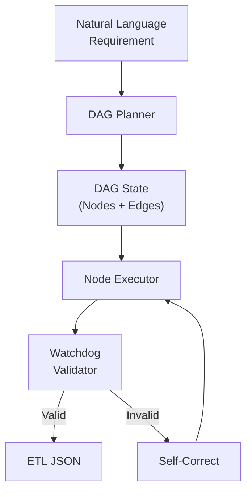

# Practical Lessons in Agent Development

> Based on real-world engineering experiences in Clinical Data ETL and Multi-Agent Systems.

---

## 1. Framework Selection Lessons

Choosing the right framework depends on your use case. Here's what we learned from production deployments:

### When to Use AutoGen (Multi-Agent Conversation)

| ✅ Good Fit | ❌ Avoid When |
|-------------|---------------|
| Deep Research / Literature Review | Strict output format required |
| Multi-role brainstorming | Complex state machine logic |
| Exploratory dialogue | Downstream engineering integration |

**Real Experience:**
- Built a system testing GPT-4o, Qwen, and Gemma for multi-agent dialogue.
- **Pro**: Easy to set up multi-agent conversation (e.g., "User" vs "Analyst").
- **Con**: Hard to control precise state transitions or enforce strict output formats.

### When to Use LangGraph (State Machine / Workflows)

| ✅ Good Fit | ❌ Avoid When |
|-------------|---------------|
| Defined business logic (Rules + AI) | Pure open-ended conversation |
| Complex ETL Pipelines | Rapid prototyping |
| Fine-grained state control | Simple single-shot tasks |

**Real Experience:**
- Implemented TSP Pricing workflow: `Markdown Parsing → Info Extraction → DB Query → Formula Calc`.
- **Key Advantage**: Fine-grained control over Graph State and transitions.
- **Key Advantage**: Easy to add "Watchdog" nodes for validation.

---

## 2. Production Case Study: Agentic ETL System

Building an AI system that converts natural language requirements into executable ETL JSON configurations.

### The Problem
Users describe data transformation needs in natural language. The system must generate valid, executable ETL configurations (1000+ lines of JSON).

### Architecture Evolution

**Phase 1: Linear Chain (Failed)**
- Initially assumed simple linear steps.
- Failed to handle complex field dependencies between transformation nodes.

**Phase 2: DAG-based Planner (Success)**



**Key Mechanisms:**
- **DAG State Management**: Tracks "Available Variables" and "Upstream Nodes" dynamically.
- **Snapshotting**: Implemented `dag_state.json` to trace the agent's reasoning process for debugging.

---

## 3. Common Anti-Patterns & Engineering Fixes

| Anti-Pattern | Symptom | Engineering Fix |
|--------------|---------|-----------------|
| **SQL Hallucination** | Agent selects non-existent columns | Feed current node's schema output in prompt state |
| **SQL Syntax Errors** | Invalid SQL generated | Add **Watchdog** nodes to validate before execution |
| **JSON Truncation** | Large configs (>1300 lines) get cut off | Strict prompt constraints (forbid Markdown blocks) |
| **Output Instability** | Complex operators cause format errors | **Few-shot** examples for Window Functions, CTEs |
| **Fuzzy RAG Results** | Vector search too imprecise for structured data | Use **Knowledge Graph** (Neo4j + CQL) instead |
| **Context Explosion** | Dumping all files into context | **Context Compression**: "Grep-first, Read-second" pattern |

### Deep Dive: The "Watchdog" Pattern

Instead of trusting LLM output blindly, add validation nodes:

```python
class SQLWatchdog:
    def validate(self, sql_output: str, schema: dict) -> bool:
        # 1. Parse SQL syntax
        try:
            parsed = sqlparse.parse(sql_output)
        except:
            return False
        
        # 2. Validate column references against schema
        columns_used = extract_columns(parsed)
        valid_columns = set(schema.keys())
        
        return columns_used.issubset(valid_columns)
```

### Deep Dive: Double-Layer Interaction

```
┌─────────────────────────────────────────────────────┐
│  Layer 1: Clarification (Human ↔ Agent)             │
│  - Resolve ambiguity in requirements                │
│  - Lock down specifications                         │
└─────────────────────────────────────────────────────┘
                        ↓
┌─────────────────────────────────────────────────────┐
│  Layer 2: Execution (Planner + Executor)            │
│  - Generate code/config deterministically           │
│  - No more user interaction needed                  │
└─────────────────────────────────────────────────────┘
```

---

## 4. Key Takeaways

1. **Framework ≠ Magic**: AutoGen and LangGraph solve different problems. Choose based on your state management needs, not hype.

2. **DAG > Linear Chain**: For any multi-step generation task, model dependencies as a DAG, not a simple chain.

3. **Watchdogs are Mandatory**: Never trust LLM output directly. Always add validation layers (schema checks, SQL parsing, JSON validation).

4. **Atomic Actions > Monolithic Output**: Instead of generating 1000-line JSON in one shot, split into atomic "Steps" that a deterministic engine assembles.

5. **Knowledge Graph > RAG for Structured Data**: When you need precise entity relationships (e.g., medical codes, database schemas), Neo4j + CQL beats Vector Search.

6. **Debug via Snapshots**: Always persist intermediate states (`dag_state.json`) to trace agent reasoning during failures.

---

> **Next Steps**: See [Architecture Patterns](./architecture-patterns.md) for detailed system designs, or [Agent FAQ](./faq.md) for common engineering questions.
