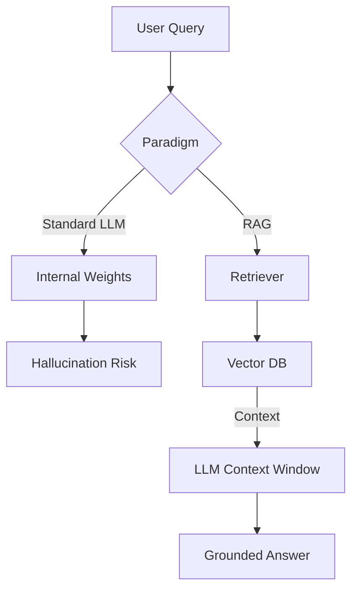
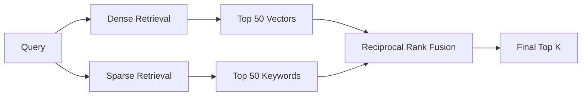
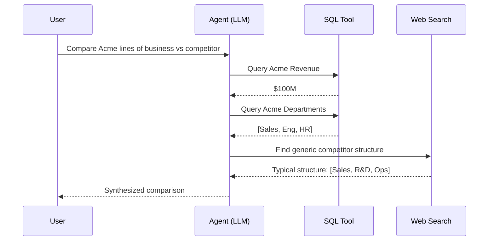

# Advanced Retrieval-Augmented Generation: A Comprehensive Engineering Guide

> **Author**: Haoming Zhang (Assisted by Gemini)
> **Version**: 1.0
> **Last Updated**: 2025-12-26
> **Target Audience**: AI Engineers, NLP Researchers, System Architects

---

## 1. Introduction: The "Open Book" Paradigm Shift

The emergence of Large Language Models (LLMs) like GPT-4, Claude 3, and Gemini has fundamentally reshaped our interaction with information. These models exhibit "sparkles of AGI" in reasoning, code generation, and creative writing. However, as they transitioned from research labs to enterprise production environments, a critical limitation became undeniable: **Knowledge Boundaries**.

### 1.1 The Compression vs. Retrieval Dilemma

To understand why RAG is necessary, we must look at the fundamental nature of an LLM. An LLM is, at its core, a **lossy compression artifact** of the internet.

*   **Training Phase**: The model reads terabytes of text (Wikipedia, GitHub, Common Crawl).
*   **Compression**: It attempts to "compress" this information into a fixed set of weights (parameters). Unlike a ZIP file which is lossless, neural compression is lossy. The model learns *associations*, *patterns*, and *probabilities*, but it does not store exact database records.
*   **Inference Phase**: When asked a fact, the model effectively "decompresses" or reconstructs the information based on probability.

This architectural reality leads to the **Hallucination** problem. When the compression is too "blurry" for a specific fact (e.g., "What was the Q3 2023 revenue of Acme Corp?"), the model fills in the gaps with statistically plausible but factually incorrect tokens.

**RAG (Retrieval-Augmented Generation)** solves this by changing the paradigm from **Closed Book Exam** (relying solely on memory) to **Open Book Exam** (relying on reasoning + access to reference materials).



### 1.2 Core Problems Solved by RAG

1.  **Hallucinations & Factuality**: By grounding generation in retrieved evidence, hallucinations are significantly reduced (though not strictly eliminated). The model shifts from "recalling" to "reading and synthesizing".
2.  **Knowledge Cutoff**: LLMs are frozen in time. RAG provides access to real-time data without re-training.
3.  **Data Privacy (The Enterprise "Moat")**: You cannot train a public LLM on your private medical records or proprietary code. RAG allows you to keep the reasoning engine (LLM) separate from the knowledge base (Vector DB), ensuring strict access controls.
4.  **Source Attribution/Explainability**: In regulated industries (Legal, Finance), an answer is useless without a citation. RAG inherently provides the source documents used to generate the answer.

### 1.3 The Evolution of RAG Architectures

*   **Naive RAG**: "Retrieve-Read-Generate". Simple chunks, standard cosine similarity, direct prompt injection.
*   **Advanced RAG**: Pre-retrieval optimization (Query rewriting), Post-retrieval optimization (Re-ranking), and sophisticated indexing (Hybrid search).
*   **Modular RAG**: RAG as a dynamic agentic workflow. The system can decide *whether* to retrieve, *what* to retrieve (SQL vs Vector), and *how* to synthesize (Summarize vs Extract).

---

## 2. The Indexing Pipeline: Building the Knowledge Base

The quality of a RAG system is **upper-bounded by the quality of its index**. Users often obsess over the LLM (GPT-4 vs Claude), but in RAG, **"Garbage In, Garbage Out"** applies strictly to the retrieval corpus.

### 2.1 Data Loading & ETL (Extract, Transform, Load)

The first mile is often the hardest. Real-world enterprise data is messy.

#### 2.1.1 The PDF Challenge
PDFs are "digital paper", designed for printing, not machine reading. They lack semantic structure.
*   **Standard Parsing**: Tools like `pypdf` or `Unstructured` extraction often fail on multi-column layouts, headers, and footers.
*   **Advanced Layout Analysis**:
    *   **LayoutLM / Donut**: Use multimodal models that "see" the page to classify regions (Title, Body, Table, Caption).
    *   **OCR Integration**: Essential for scanned docs. Tesseract is free but struggles with handwriting. Commercial APIs (Amazon Textract, Azure Document Intelligence) are standard for production.
    *   **Table Extraction**: Tables are the kryptonite of RAG. Flattening a table row-by-row destroys vertical relationships.
        *   *Solution*: Using **Table Transformer** (TATR) to detect table structures and converting them to HTML/Markdown summaries, or preserving them as separate "parent chunks".

#### 2.1.2 Data Cleaning
Before chunking, text must be sanitized:
*   **De-duplication**: Repeated boilerplate (legal disclaimers, navigation menus) pads the context window and dilutes relevance.
*   **PII Redaction**: Using Presidio or standard regex to mask Emails/SSNs before embedding.

### 2.2 Chunking Strategies: The Art of Segmentation

Chunking is not just splitting strings; it's **defining the atomic unit of meaning**.

#### 2.2.1 Fixed-Size Chunking
The baseline approach.
*   **Character-based**: `len(text) < 500`. Prone to cutting words in half.
*   **Token-based**: `len(tokenizer.encode(text)) < 500`. Safer for LLMs.
*   **Overlap**: Essential. A split mid-sentence loses context. 10-20% overlap serves as a "contextual bridge".

#### 2.2.2 Recursive Chunking
The industry standard (e.g., LangChain's `RecursiveCharacterTextSplitter`).
*   **Mechanism**: It creates a hierarchy of separators (Paragraph `\n\n` -> Sentence `\n` -> Word ` `). It tries to split by paragraph first; if the chunk is still too big, it drills down to sentences.
*   **Why it works**: It tries to respect the natural semantic boundaries of the text.

#### 2.2.3 Semantic Chunking (Advanced)
Instead of arbitrary length, split by **topic shift**.
> **Example: Before vs After**
> *   **Raw Text**: "The Apollo 11 mission launched on July 16, 1969. It carried Armstrong, Aldrin, and Collins. The Saturn V rocket was the most powerful ever built. In 2024, NASA plans to return with Artemis."
> *   **Fixed Chunking**: Chunk 1 ends at "...most powerful". Chunk 2 starts "ever built...". *Result*: The sentence about Saturn V is split, losing meaning.
> *   **Semantic Chunking**: Detects the shift from "Apollo history" to "Artemis future".
>     *   *Chunk 1*: Apollo details (July 16... Collins... Saturn V).
>     *   *Chunk 2*: Artemis plans (In 2024...).

*   **Algorithm**:
    1.  Split text into sentences.
    2.  Calculate embeddings for each sentence (or sliding window of 3 sentences).
    3.  Calculate Cosine Similarity between consecutive sentences.
    4.  **Identify "Valleys"**: If similarity drops below a threshold (e.g., 0.7), it indicates a topic transition. Start a new chunk there.
*   **Benefit**: Results in chunks that are thematically coherent, improving retrieval precision.

#### 2.2.4 Agentic / Proposition Parsing
Breaking text down into atomic independent statements (propositions) rather than raw text spans.
*   *Text*: "Google was founded by Larry Page and Sergey Brin while they were Ph.D. students at Stanford University."
*   *Propositions*:
    1.  "Google was founded by Larry Page."
    2.  "Google was founded by Sergey Brin."
    3.  "Larry Page and Sergey Brin were Ph.D. students at Stanford University when they founded Google."
*   **Usage**: Index the propositions for dense retrieval, but return the original parent paragraph to the LLM for context.

### 2.3 The Embedding Model: Mapping Meaning to Math

Embeddings map discrete text into a continuous vector space (Latent Space).

#### 2.3.1 Technical Deep Dive: Contrastive Learning
Modern embeddings (like OpenAI `text-embedding-3` or `BGE`) are typically trained using Checkpoint-based Contrastive Learning.
*   **Triplet Loss**: The model sees an Anchor (A), a Positive (P) [related text], and a Negative (N) [unrelated text].
*   **Objective**: Minimize `Distance(A, P)` and Maximize `Distance(A, N)`.
*   **Hard Negatives**: The secret sauce. Training on "easy" negatives (Anchor: "Apples", Negative: "Nuclear Physics") is trivial. Training on "hard" negatives (Anchor: "Java Programming", Negative: "JavaScript Programming") forces the model to learn subtle semantic distinctions.

#### 2.3.2 Selecting a Model (MTEB Leaderboard)
Don't guess; look at **MTEB (Massive Text Embedding Benchmark)**.
*   **Proprietary**:
    *   **OpenAI `text-embedding-3-large`**: High dimension (3072), excellent general performance, native Matryoshka support (shortening vectors without re-training).
    *   **Cohere Embed v3**: Specifically trained for RAG (retrieval quality), distinct from semantic similarity models.
*   **Open Source (SOTA)**:
    *   **BGE-M3 (BAAI)**: Multi-lingual, Multi-functionality (Dense + Sparse + ColBERT). A powerhouse for Chinese/English mixed corpuses.
    *   **E5-Mistral-7b**: Massive model, strictly SOTA, but expensive to host.

#### 2.3.3 Fine-Tuning Embeddings
**When to do it**: If your domain is highly specific (e.g., Genomics, Proprietary Legal Contracts) and standard models fail to cluster your concepts.
**How**:
1.  Generate a synthetic dataset: Use GPT-4 to read your documents and generate `(Question, Relevant Chunk)` pairs.
2.  Use `SentenceTransformers` library with `MatryoshkaLoss` or `MultipleNegativesRankingLoss`.
3.  Result: A smaller, domain-adapted model often outperforms GPT-4's base embedding on your specific data.

### 2.4 The Vector Database: The Retrieval Engine

Vector DBs are approximate nearest neighbor searches (ANN) at scale.

#### 2.4.1 HNSW (Hierarchical Navigable Small World)
The industry standard algorithm (used by Pinecone, Weaviate, Milvus).
*   **Concept**: A multi-layer graph.
    *   **Top Layer**: Highways / Interstates. Long jumps across the vector space.
    *   **Bottom Layer**: Local streets. Precise hop-by-hop navigation.
*   **Search**: You start at the top, greedily find the closest node, drop down a layer, refine, drop down, repeat.
*   **Trade-off**: Fast search, but high memory usage (graph needs to be in RAM for speed).
*   **Key Parameters (Deep Dive)**:
    *   `M` (Max Links): Number of edges per node. Higher `M` = Higher Recall, Higher Memory, Slower Insert. Typical value: 16-64.
    *   `ef_construction` (Exploration Factor): How "wide" to search during index build. Higher = Better index quality, Slower build.
    *   `ef_search`: How many candidates to track during query. Hard trade-off between Latency (low `ef`) and Recall (high `ef`).

#### 2.4.2 IVF (Inverted File Index)
*   **Concept**: Clustering. Divide the vector space into 1000 Voronoi cells (clusters).
*   **Search**: Identify which cell the query vector falls into. Only search vectors inside that cell (and maybe neighbors).
*   **Trade-off**: Lower memory usage, but "Recall" can suffer if the closest vector acts as a boundary case in an adjacent cell.

#### 2.4.3 Choosing a DB
*   **Pinecone**: Fully managed, "Serverless" architecture is very popular. strictly separate storage/compute.
*   **Weaviate**: Open-source, strong hybrid search (built-in BM25), supports "Multi-Tenancy" natively.
*   **Milvus**: The "Big Data" option. Designed for billions of vectors. Complex architecture (proxies, query nodes, data nodes).
*   **Chroma / LanceDB**: Embedded options. Great for local RAG or simple apps. LanceDB is unique for being serverless and on-disk (using the Lance columnar format), requiring almost no RAM setup.

---

## 3. The Retrieval Pipeline: Finding the Needle in the Haystack

Once your data is indexed, the challenge becomes **retrieval precision**. Standard cosine similarity is often insufficient because queries are short and ambiguous, while documents are long and dense.

### 3.1 Advanced Search Algorithms

#### 3.1.1 Hybrid Search (The Golden Standard)
Vector search (Dense) is great for semantic understanding ("Apple" ≈ "iPhone"). Keyword search (Sparse/BM25) is great for exact matching ("Model ID: A1423").
*   **Mechanism**:
    1.  Run Dense Vector Retrieval -> Get Top 50.
    2.  Run Partition-Based Keyword Retrieval (BM25) -> Get Top 50.
    3.  **Reciprocal Rank Fusion (RRF)**: Combine the two lists.
        $$ RRFscore(d) = \sum_{rank \in R} \frac{1}{k + rank} $$
    *   This ensures that a document appearing in *both* lists gets boosted significantly.
*   **Why use it?**: It solves the "Zero-Shot" problem where embeddings fail on specific acronyms or serial numbers that they've never seen during training.



### 3.2 Query Transformations: Fixing the User's Input

Users are bad at prompting. "pricing" is a bad query. "What are the enterprise licensing costs for Q3?" is a good query. We use the LLM to rewrite the query *before* retrieval.

#### 3.2.1 HyDE (Hypothetical Document Embeddings)
*   **Concept**: Retrieval works best when `Query` and `Document` look alike. But `Query` is short/interrogative, `Document` is long and declarative.
*   **Process**:
    1.  User Query: "How to reset router?"
    2.  **LLM Generation**: "To reset the router, find the small button on the back, hold it for 10 seconds until lights flash..." (This is a *hallucinated* answer).
    3.  **Embedding**: Embed this *hallucinated answer*.
    4.  **Retrieval**: Search against the real index using the *hallucinated vector*.
    4.  **Retrieval**: Search against the real index using the *hallucinated vector*.
*   **Why it works**: The hallucination might be factually wrong, but it captures the *semantic structure* and *vocabulary* of a valid answer, making it closer in vector space to the real documentation.
    > **Example**:
    > *   *Query*: "How to fix Error 503?" (Too short, ambiguous).
    > *   *HyDE Hallucination*: "Error 503 Service Unavailable indicates the server is temporarily busy. To fix it, check the load balancer logs, restart the Nginx service, and verify upstream health checks."
    > *   *Result*: The hallucination contains keywords ("load balancer", "Nginx", "upstream") that match the actual technical documentation, even though the user didn't know them.

#### 3.2.2 Multi-Query Expansion
*   **Process**: Use an LLM to generate 3-5 variations of the user's question from different perspectives.
*   **Execution**: Run retrieval for *all* variations. De-duplicate the results (Set Union).
*   **Benefit**: Increases **Recall**. Overcomes the "lexical gap" where the user uses different terminology than the documentation.

#### 3.2.3 Query Routing
Not all queries need the vector DB.
*   **Logical Router**: An LLM classifier decides:
    *   "Summarize this document" -> **Summary Index** (Retrieve whole chunks).
    *   "What is the penalty for late payment?" -> **Vector Index** (Retrieve specific chunks).
    *   "What is the trend in sales?" -> **Text-to-SQL Engine** (Query relational DB).

### 3.3 Context Enrichment: The "Small-to-Big" Strategy

Embeddings for retrieval (matching) and Content for generation (reading) have different optimal sizes.
*   **Problem**: A small chunk is good for matching specific meaning, but lacks surrounding context for the LLM to answer fully.
*   **Solution**: Decouple Retrieval Chunk from Generation Context.

#### 3.3.1. Parent Document Retrieval
1.  **Split**: Break document into small children (128 tokens) and keep reference to parent (512 tokens).
2.  **Index**: Embed the children.
3.  **Retrieve**: Search against children.
4.  **Return**: If a child is a match, return its **Parent** chunk to the LLM.
*   **Result**: Precise hit, broad context.

#### 3.3.2 Sentence Window Retrieval
1.  **Index**: Embed single sentences.
2.  **Storage**: in Metadata, store the `window` (3 sentences before, 3 after).
3.  **Retrieve**: Match single sentence.
4.  **Return**: Inject the full window.

---

## 4. Post-Retrieval & Generation Optimization

You retrieved 20 chunks. They might contain conflicting info, duplicates, or pure noise. You cannot simple dump them all into the prompt (Context Window limits, Cost, "Lost in the Middle").

### 4.1 Re-Ranking (The Most Critical "Quick Win")

If you implement one advanced RAG technique, make it **Re-Ranking**.
*   **Bi-Encoder (Standard Retrieval)**: Fast. Scores $Score(A, B) = CosSim(\vec{A}, \vec{B})$. vectors are computed independently.
*   **Cross-Encoder (Re-Ranker)**: Slow but accurate. It takes the pair `(Query, Document)` and feeds them *together* into a BERT model to output a relevance score (0-1). It sees the full interaction between terms.
*   **Workflow**:
    1.  Retrieve Top 50 using fast Bi-Encoder (Vector DB).
    2.  Pass Top 50 to Cross-Encoder (e.g., `bge-reranker-large`).
    3.  Sort by score. Take Top 5 for the LLM.
    3.  Sort by score. Take Top 5 for the LLM.
*   **Impact**: Often boosts accuracy by 10-20% absolute points.
    > **Visualizing the Impact**:
    > *   *Before Re-ranking (Vector only)*: [1. Distantly related, 2. Irrelevant, 3. Exact Match, 4. Irrelevant, 5. Weakly related] -> **LLM confused by noise**.
    > *   *After Re-ranking*: [1. Exact Match, 2. Distantly related, 3. Weakly related, 4. Irrelevant, 5. Irrelevant] -> **LLM sees the answer first**.

### 4.2 Context Compression (LLMLingua)
Even with Top 5, context can be huge.
*   **Token Optimization**: Tools like **LLMLingua** (Microsoft) use a small model (LLaMA-7B) to calculate the perplexity of tokens in the context.
*   **Compression**: It removes tokens that have low perplexity (high predictability, low information value) relative to the query, preserving key entities and numbers.
*   **Result**: Compresses 10k tokens context to 2k tokens with minimal performance loss.

### 4.3 Generation: Prompt Engineering for RAG

The final "Last Mile".
*   **Source Citation Prompting**:
    > "Answer entirely based on the provided context. If the answer is not in the context, state 'I do not know'. For every statement, cite the Source ID like [1]."
*   **Chain of Thought (CoT)**:
    > "First, identify the relevant quotes from the context. Then, synthesize the answer."
*   **Noise Robustness**: Explicitly instruct the model to ignore irrelevant chunks. "Some context provided may be irrelevant. Ignore it."

---

## 5. Evaluation: How to Measure Success

You cannot improve what you cannot measure. RAG systems are notoriously hard to evaluate because the "correct answer" is often subjective.

### 5.1 The RAG Triad

A holistic evaluation must measure three distinct correlations:
1.  **Context Relevance** (Retrieval Quality): Is the retrieved context actually related to the query?
    *   *Metric*: Precision@K, Recall@K.
2.  **Answer Faithfulness** (Generation Quality): Is the answer derived *solely* from the context, or is the model hallucinating from its pre-trained memory?
3.  **Answer Relevance** (End-to-End Quality): Does the generated answer actually address the user's original question?

### 5.2 Frameworks & Metrics

#### 5.2.1 RAGAS (Retrieval Augmented Generation Assessment)
RAGAS is the industry standard open-source framework. It uses an "LLM-as-a-Judge" approach.
*   **Faithfulness Score**: Break the answer into statements. Verify each statement against the context using GPT-4.
*   **Answer Relevancy**: Generate artificial questions from the answer and check similarity to the original question.
*   **Context Precision**: Check if the "ground truth" chunks are ranked high in the retrieval list.

#### 5.2.2 TruLens
Focuses on "Feedback Functions". It allows you to instrument your RAG chain (LangChain/LlamaIndex) and log every step.
*   **Feedback Function**: A python function that takes `(input, output)` and returns a score (0-1).
*   **Dashboard**: Visualize the latency, cost, and quality scores for every run.

### 5.3 Golden Datasets
You need a "Golden Dataset" (Question, Answer, Ground Truth Chunk) for regression testing.
*   **Synthetic Generation**: Use the **ragas-synthetic-data-generator**.
    *   Input: Your raw documents.
    *   Action: It uses GPT-4 to generate diverse questions (Simple, Reasoning, Multi-context) and their answers based on specific document chunks.
    *   Result: A test set of 100 QA pairs to run evaluating against every pipeline change.

---

## 6. Architecture & Engineering Patterns

### 6.1 The "Agentic RAG"
Moving beyond linear chains.
*   **Concept**: The LLM is not just a "Synthesis Engine" but a "Reasoning Engine" that controls the retrieval tools.
*   **Tools**:
    *   **Vector Tool**: For semantic questions.
    *   **SQL Tool**: For structured data analytics.
    *   **Web Search Tool**: For real-time info (e.g., Tavily, Serper).
*   **Workflow**:
    1.  User: "Compare the revenue of Acme Corp in 2023 vs their competitor."
    2.  Agent: *Calls SQL Tool* to get Acme Revenue.
    3.  Agent: *Calls Web Search* to identify competitor.
    4.  Agent: *Calls Web Search* to get competitor revenue.
    5.  Agent: Synthesize final answer.



### 6.2 Application: Chat with Documents
*   **Challenge**: "Conversational Memory".
*   **Solution**: Condense the history.
    *   User: "What is its battery life?" (Depends on previous "I'm looking at the iPhone 15").
    *   **Standalone Question Generator**: An intermediate LLM call rewrites "What is its battery life?" + `History` -> "What is the battery life of the iPhone 15?".
    *   Retrieve using the *rewritten* question.

### 6.3 Enterprise Access Control (ACLs)
*   **Problem**: You verify Document A is visible to User X.
*   **Vector DB Solution**: Store ACLs in metadata (e.g., `allow_list: ["group_engineering", "user_123"]`).
*   **Filter**: Apply metadata filters *during* the vector search query.
    *   `index.query(vec, filter={"allow_list": {"$in": user_groups}})`
    *   *Warning*: Post-retrieval filtering breaks pagination (you might filter out all Top 10 results and return nothing). Always filter *in-search*.

---

## 7. Future Trends: What's Next?

### 7.1 GraphRAG
Vectors capture semantic similarity but miss structural relationships.
*   **Knowledge Graphs**: Nodes (Entities) and Edges (Relationships).
*   **Mechanism**: Extract entities and relationships using LLMs. Build a graph.
*   **Query**: "How does the CEO's resignation affect the project X?" -> Traverse graph from `CEO` -[resigned]-> `Company` -[owns]-> `Project X`.
*   **Microsoft GraphRAG**: Recently open-sourced. Combines community detection algorithms on graphs with global summarization.

### 7.2 Long Context LLMs vs RAG
With Gemini 1.5 Pro (1M context) and Claude 3 (200k), do we need RAG?
*   **Yes, specifically for**:
    *   **Latency**: Filling 1M tokens takes seconds/minutes to process (Time to First Token). RAG is milliseconds.
    *   **Cost**: Re-reading 1M tokens for every query is prohibitively expensive ($10/query).
    *   **Data Updates**: You can update a vector in milliseconds. You cannot update the model's weights easily.
*   **Future**: **Long Context RAG**. Retrieve larger chunks (10k tokens) instead of small chunks (500 tokens), letting the LLM handle the fine-grained synthesis.

### 7.3 RAFT (Retrieval Augmented Fine Tuning)
*   **Concept**: Fine-tuning the LLM *to be better at RAG*.
*   **Training Data**: Questions + *Distractor Documents* + *Correct Documents* + Chain of Thought.
*   **Outcome**: The model learns to ignore noise and focus on the relevant snippets, strictly adhering to the "Open Book" style.

---

> **End of Guide**

---

## Appendix A: Implementation Reference (Python)

### A.1 Advanced Chunking (LangChain)
```python
from langchain.text_splitter import RecursiveCharacterTextSplitter
from langchain.document_transformers import LongContextReorder

def sane_chunking(text):
    # Split by Paragraph -> Sentence -> Word
    splitter = RecursiveCharacterTextSplitter(
        separators=["\n\n", "\n", " ", ""],
        chunk_size=512,  # Target 512 chars (approx 128 tokens) for dense embedding
        chunk_overlap=50, # Keep context overlap
        length_function=len,
        is_separator_regex=False
    )
    chunks = splitter.create_documents([text])
    return chunks

# Lost in the Middle Reordering
def reorder_documents(docs):
    # Reorders so most relevant docs are at start and end of context
    reordering = LongContextReorder()
    return reordering.transform_documents(docs)
```

### A.2 Hybrid Search Strategy (Pseudocode)
```python
def hybrid_search(query, top_k=10):
    # 1. Dense Search (Vector)
    query_vec = embedding_model.embed(query)
    dense_results = vector_db.search(query_vec, k=top_k * 2)
    
    # 2. Sparse Search (BM25)
    sparse_results = keyword_engine.search(query, k=top_k * 2)
    
    # 3. Reciprocal Rank Fusion
    fused_scores = {}
    k_constant = 60
    
    for rank, doc in enumerate(dense_results):
        if doc.id not in fused_scores: fused_scores[doc.id] = 0
        fused_scores[doc.id] += 1 / (k_constant + rank)
        
    for rank, doc in enumerate(sparse_results):
        if doc.id not in fused_scores: fused_scores[doc.id] = 0
        fused_scores[doc.id] += 1 / (k_constant + rank)
    
    # Sort by fused score
    final_results = sorted(fused_scores.items(), key=lambda x: x[1], reverse=True)[:top_k]
    return final_results
```

### A.3 Evaluation with RAGAS
```python
from ragas import evaluate
from ragas.metrics import (
    context_precision,
    faithfulness,
    answer_relevancy,
)
from datasets import Dataset

def eval_pipeline(questions, answers, contexts, ground_truths):
    data = {
        'question': questions,
        'answer': answers,
        'contexts': contexts,
        'ground_truth': ground_truths
    }
    dataset = Dataset.from_dict(data)
    
    results = evaluate(
        dataset,
        metrics=[
            context_precision,
            faithfulness,
            answer_relevancy,
        ],
    )
    return results
```


