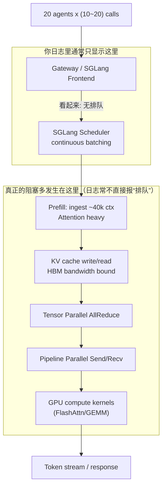

# Performance Tuning & Capacity Planning

## 1. 到底堵在哪里？(Inference Bottlenecks)

### 现象：没排队但很慢
你看到的“没排队”，通常只表示请求没有卡在 **入口队列**，但它们可能都已经进入了同一个更深层的瓶颈：**GPU 的 prefill/attention、KV cache 带宽、TP/PP 通信**。

### 关键事实
在 **40k+ 长上下文 + 685B + 多 agent** 的 workload 中，prefill（把 40k tokens 的上下文喂进去那一步）往往远远比 decode 更重。
“没排队”很可能只是：都在跑 prefill，每个 prefill 都特别慢，于是整体看起来“全在执行、但很慢”。

### 阻塞点全景（按概率排序）
1.  **Prefill 的 Attention 计算**：长上下文 $O(seq^2)$。
2.  **KV Cache 写入/读取**：导致的 HBM 带宽瓶颈（memory-bound）。
3.  **TP/PP 的 NCCL 通信**：AllReduce / SendRecv 在内部排队。
4.  **Continuous Batching 效率下降**：并发过高导致 cache locality 变差。

### 阻塞流程图

---

## 2. 计算“理论最优 agent 并发数”

### 核心思路
并发能开到多大，先看 KV cache 能 **装下** 多少条长上下文序列；但真正的“**最优**”通常还要被 **prefill 计算** 限制（长上下文下，计算上最优往往比内存上界更小）。

### 2.1 KV Cache 维度：内存上界
对带 GQA/MQA 的模型，单 token、单层的 KV 大小近似为：
$$KV_{per\_token} \approx 2 \times (H \times r) \times b \text{ bytes}$$

其中：
*   $L$ = 总层数
*   $S$ = 上下文长度（例如 40,000）
*   $H$ = Hidden size
*   $r$ = KV 头比例 ($num\_kv\_heads / num\_heads$)
*   $b$ = dtype bytes (FP16/BF16 为 2)
*   $PP$ = Pipeline stages

单 GPU（单 stage）为一条序列存 KV 的公式：
$$KV_{per\_seq\_per\_GPU} \approx S \times (L/PP) \times 2 \times (H \times r) \times b$$

#### 685B 量级示例估算
假设 $S=40,000$, $L=80$, $H=16,384$, $r=1/8$, $b=2$, $PP=8$。

*   **每 token 每层**: $2 \times (16384 \times 1/8) \times 2 = 8192$ bytes $\approx 8$ KB
*   **每 GPU 每序列**: $40,000 \times 10 \text{ (layers)} \times 8 \text{ KB} = 3.2 \text{ GB}$

**结论**：每个 40k 请求仅 KV 就占 ~3.2GB 显存。
如果是 H100 80GB，KV 可用空间约 40GB，则上限约为 **12** 条并发（但这只是内存上限）。

### 2.2 真正的最优并发（Throughput 最佳点）
对超长上下文 Agent 任务，“最优”基本被 **Prefill** 限死。
并发太多会导致：Attention kernel 变慢、HBM 带宽打满、TP/PP 通信拥塞。

**经验推荐**：
设 $R$ = 模型 Replica 数量（一整套 TP×PP 算一个 Replica）。

*   **最稳并发**：$2 \times R$
*   **上探并发**：$4 \times R$

> **警示**：超过 $4 \times R$ 通常对长上下文是负优化（“不排队但更慢”）。如果你只有 1 个 Replica，那最优并发大概率就是 **2~4**，而不是 20。
