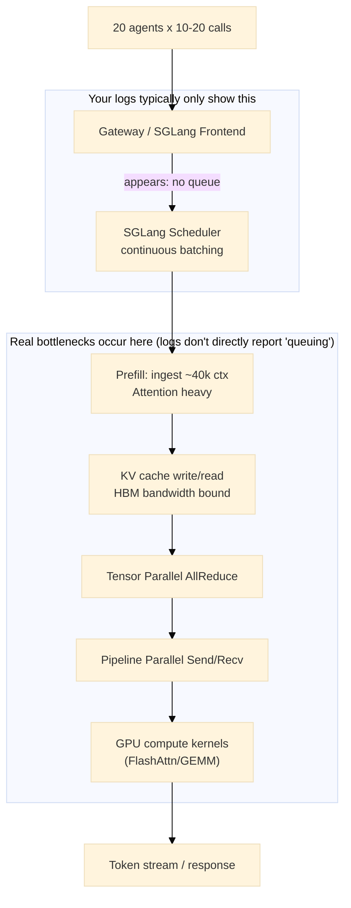

# Performance Tuning & Capacity Planning

## 1. Where is the Bottleneck? (Inference Bottlenecks)

### Phenomenon: No Queue but Slow
What you observe as "no queue" typically only indicates that requests are not stuck at the **entry queue**, but they may have all entered a deeper bottleneck: **GPU's prefill/attention, KV cache bandwidth, or TP/PP communication**.

### Key Facts
In workloads with **40k+ long context + 685B + multi-agent**, prefill (the step of feeding 40k tokens of context) is often far more expensive than decode.
"No queue" likely means: everyone is running prefill, each prefill is very slow, so overall it looks like "all executing but very slow".

### Bottleneck Panorama (Ranked by Probability)
1.  **Prefill Attention Computation**: Long context $O(seq^2)$.
2.  **KV Cache Write/Read**: HBM bandwidth bottleneck (memory-bound).
3.  **TP/PP NCCL Communication**: AllReduce / SendRecv queuing internally.
4.  **Continuous Batching Efficiency Decline**: High concurrency degrades cache locality.

### Bottleneck Flowchart

---

## 2. Calculate "Theoretical Optimal Agent Concurrency"

### Core Idea
Maximum concurrency depends first on how many long-context sequences the KV cache can **hold**, but the true "**optimal**" is usually limited by **prefill computation** (with long context, computational optimum is often smaller than memory upper bound).

### 2.1 KV Cache Dimension: Memory Upper Bound
For models with GQA/MQA, per-token, per-layer KV size is approximately:
$$KV_{per\_token} \approx 2 \times (H \times r) \times b \text{ bytes}$$

Where:
*   $L$ = Total layers
*   $S$ = Context length (e.g., 40,000)
*   $H$ = Hidden size
*   $r$ = KV head ratio ($num\_kv\_heads / num\_heads$)
*   $b$ = dtype bytes (FP16/BF16 is 2)
*   $PP$ = Pipeline stages

Formula for single GPU (single stage) storing KV for one sequence:
$$KV_{per\_seq\_per\_GPU} \approx S \times (L/PP) \times 2 \times (H \times r) \times b$$

#### 685B Scale Example Estimation
Assume $S=40,000$, $L=80$, $H=16,384$, $r=1/8$, $b=2$, $PP=8$.

*   **Per token per layer**: $2 \times (16384 \times 1/8) \times 2 = 8192$ bytes $\approx 8$ KB
*   **Per GPU per sequence**: $40,000 \times 10 \text{ (layers)} \times 8 \text{ KB} = 3.2 \text{ GB}$

**Conclusion**: Each 40k request occupies ~3.2GB VRAM for KV alone.
With H100 80GB and ~40GB available KV space, the upper limit is approximately **12** concurrent sequences (but this is just the memory limit).

### 2.2 True Optimal Concurrency (Throughput Sweet Spot)
For ultra-long context Agent tasks, "optimal" is basically capped by **Prefill**.
Too much concurrency causes: Attention kernels slow down, HBM bandwidth saturated, TP/PP communication congestion.

**Experience Recommendation**:
Let $R$ = Number of model Replicas (one complete TP×PP set counts as one Replica).

*   **Most Stable Concurrency**: $2 \times R$
*   **Exploratory Concurrency**: $4 \times R$

> **Warning**: Exceeding $4 \times R$ is usually negatively optimized for long context ("no queue but slower"). If you only have 1 Replica, optimal concurrency is most likely **2~4**, not 20.
