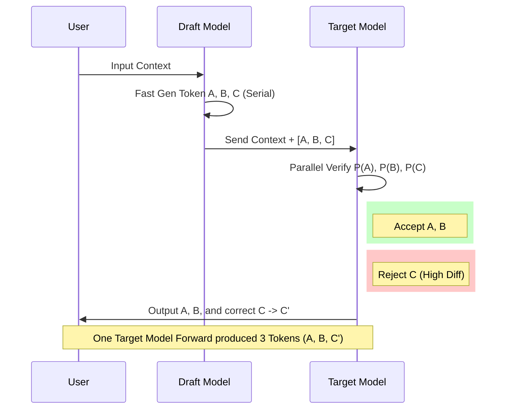

# Speculative Decoding

This is a technique that significantly accelerates inference without changing the original model structure, simply by altering the decoding process.

## Core Process

1.  **Draft**: Use a small model (Draft Model, fast speed) to quickly generate a sequence of candidate Tokens (e.g., 5 tokens).
2.  **Verify**: The large model (Target Model) validates the probability of this sequence of Tokens in parallel.
3.  **Accept/Reject**: Compare the probability distributions of the large and small models. If the small model's "guess" is accepted by the large model, it is kept; once a rejection point is met, subsequent tokens are discarded, and the large model corrects and continues generation.

## Process Diagram



## Key Points
- **Parallel Evaluation**: The time for the large model to verify N tokens $\approx$ the time to generate 1 token (because matrix operations are parallelizable).
- **Lossless Acceleration**: If the sampling strategy is set correctly (e.g., based on Rejection Sampling), the output distribution of speculative decoding is **exactly consistent** with the large model generating independently, without degrading generation quality.

---

## Tensor Trace: The Math Behind Parallel Verification

Usually, it's hard to visualize *why* Speculative Decoding is faster just by looking at diagrams. Let's trace the tensor dimensions in a "Minimal PyTorch Implementation" to see exactly how the **Parallel Verification** happens.

**Assumptions:**
*   `batch_size = 1`
*   Sequence length `L = 6` (3 prefix tokens + 3 draft tokens)
*   Hidden dimension `d_model = 8`
*   `vocab_size = 1000`

**1. Input Representation**
Input `tokens` has shape `(1, 6)`.
After embedding, we get `x` of shape `(1, 6, 8)`.
> **Note**: The draft tokens are *already* appended to the input. We feed `[Prefix, d1, d2, d3]` into the model all at once.

**2. Projections (Q/K/V)**
All projections `Q`, `K`, `V` maintain the shape `(1, 6, 8)`. We simply project each of the 6 tokens into 8-dim vectors.

**3. Multi-Head Split**
Assuming 2 heads, the shape becomes `(1, 2, 6, 4)`.
Each head processes the full sequence length of 6.

**4. Attention Matrix (The "Causal" Mask)**
The attention scores have shape `(1, 2, 6, 6)`.
This `6x6` matrix means every token attends to all previous tokens (including itself).
*   Token 3 ($d_1$) attends to Tokens 0-2 (Prefix) and 3 ($d_1$).
*   Token 4 ($d_2$) attends to Prefix, $d_1$, and $d_2$.
This effectively simulates "what the state would be" if we had generated them one by one.

**5. Output Generation**
After Attention and MLP layers, we get `x_out` of shape `(1, 6, 8)`.
Finally, projecting to vocabulary gives `logits` of shape `(1, 6, 1000)`.

**6. The "Magic": Parallel Verification**
This is the most critical part where misconceptions often occur.
`logits` shape `(1, 6, 1000)` contains the prediction distributions for *every* position.

*   `logits[0, 2]` (End of Prefix) $\rightarrow$ Predicts the 4th token ($d_1$).
*   `logits[0, 3]` (At $d_1$) $\rightarrow$ Predicts the 5th token ($d_2$).
*   `logits[0, 4]` (At $d_2$) $\rightarrow$ Predicts the 6th token ($d_3$).

In a standard generation loop, we waste these intermediate logits. But here, we use them to verify our drafts:

```python
# Draft tokens we want to verify: [d1, d2, d3]
# Their actual indices in the input 'tokens' tensor are [3, 4, 5]

# To verify d1: We check the prediction made by the token BEFORE it (Index 2)
P_d1 = probs[0, 2, d1_id] 

# To verify d2: We check the prediction made by d1 (Index 3)
P_d2 = probs[0, 3, d2_id]

# To verify d3: We check the prediction made by d2 (Index 4)
P_d3 = probs[0, 4, d3_id]

# The logit at Index 5 predicts the *next* new token (d4 or correction)
```

**Key Takeaway**:
Because transformers process the entire sequence `L=6` in parallel (thanks to the Attention Matrix), we get the verification probabilities for all 3 draft tokens in a **single Forward Pass**. This is why verifying $N$ tokens is $N$ times faster than generating them one by one.
