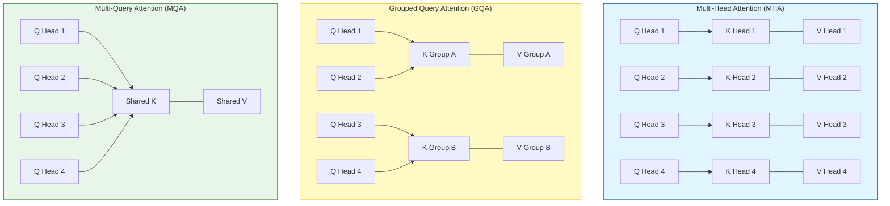

# KV Cache Strategies

KV Cache is one of the core performance bottlenecks in LLM inference. In the auto-regressive generation process, the Key (K) and Value (V) matrices of historical tokens need to be cached to avoid re-computation. As context length increases, KV Cache memory usage grows linearly.

## 0. Background: Prefill vs Decode

*   **Prefill Phase**: The model processes the user input (prompt) in parallel. This is **compute-bound**. We compute the KV states for all input tokens.
*   **Decode Phase**: The model generates one token at a time. Each step depends on *all* previous history. This is **memory-bound** because we must load the huge model weights + huge KV cache just to compute 1 token.

### Memory Calculation Formula
How much VRAM does the KV Cache actually take?

$$ \text{Size} = \text{batch\_size} \times \text{seq\_len} \times 2 \times \text{num\_layers} \times \text{hidden\_size} \times \text{sizeof(dtype)} $$

*   **2**: For K and V matrices.
*   **sizeof(dtype)**: 2 bytes for FP16/BF16.

**Example**: LLaMA-2 7B (FP16)
*   `hidden_size`: 4096
*   `num_layers`: 32
*   `seq_len`: 4096 (Full context)
*   `batch_size`: 1

$$ \text{Size} \approx 1 \times 4096 \times 2 \times 32 \times 4096 \times 2 \text{ bytes} \approx 2 \text{ GB} $$

*Note: This 2GB is **per request**. If you batch 64 requests, you need 128GB of VRAM just for cache! This is why optimizations like GQA are critical.*

## 1. Attention Architectures

Below are several mainstream Attention structures and their optimization strategies for KV Cache:

## 1. GQA (Grouped Query Attention)
- **Principle**: A middle ground between MHA and MQA. Query heads are divided into groups, and each group shares the same pair of K/V heads. For example, 8 Query heads divided into 4 groups means every 2 Query heads share 1 KV head.
- **Advantage**: Significantly reduces KV Cache memory usage (reduction factor equals the number of Queries per group) while retaining better model expressiveness than MQA.
- **Application**: LLaMA-2 70B, LLaMA-3, etc. Can be directly applied to existing models (requires fine-tuning) or used in new model training. Suitable for medium context lengths.

## 2. MQA (Multi-Query Attention)
- **Principle**: Extreme compression. All Query heads share a **single** pair of K/V heads.
- **Advantage**: Extremely high compression rate (KV Cache size is $1/H$ of MHA), very fast inference speed, suitable for ultra-long contexts and high concurrency scenarios.
- **Disadvantage**: Some loss in model expressiveness; typically requires fine-tuning to recover accuracy.

## 3. MLA (Multi-Head Latent Attention)
- **Principle**: Innovative architecture proposed by DeepSeek V3/V2. Compresses KV vectors into a low-dimensional Latent Space. During inference attention score calculation, it temporarily "decodes" into a multi-head structure (or computes directly in the compressed space).
- **Features**:
  - **Structural Optimization**: Must be defined during the pre-training phase; cannot be easily obtained by modifying existing models.
  - **Ultimate Compression**: Achieves MQA-like memory usage while retaining the powerful expressiveness of Multi-Head Attention.

## 4. Hybrid & Sparse Attention Strategies

While GQA/MQA compress the *embedding definition* of keys/values, Hybrid strategies limit *which* keys/values are actually stored or attended to.

### 4.1 Sliding Window Attention (SWA)
Instead of attending to *all* history, the model only attends to the most recent $W$ tokens.
*   **Mechanism**: A fixed-size window (e.g., 4096 tokens) slides with generation. Older KV pairs are evicted (dropped) from VRAM.
*   **Application**: **Mistral 7B**.
*   **Effect**: Memory usage becomes constant $O(W)$ instead of linear $O(N)$.
*   **Receptive Field**: Surprisingly, effective receptive field can be $> W$ due to layer stacking (token $i$ attends to $i-W \dots i$, and $i+1$ attends to $i+1-W \dots i+1$, so information propagates).

### 4.2 StreamingLLM (Attention Sinks)
Standard Sliding Window fails if we just blindly drop old tokens, because the first few tokens (starting tokens) contain crucial "attention sink" information (high attention scores).
*   **Strategy**: Keep the **first 4 tokens** (Sink Tokens) + **Sliding Window** of recent tokens.
*   **Result**: Infinite streaming capability without re-training.
*   **Paper**: [Efficient Streaming Language Models with Attention Sinks](https://arxiv.org/abs/2309.17453)

### 4.3 Longformer / BigBird / Sparse Attention
Patterns that mix different attention types:
*   **Global Attention**: Specific tokens (like `[CLS]` or user prompts) attend to everything.
*   **Local Attention**: Tokens attend to neighbors.
*   **Random Attention**: Tokens attend to random distant tokens.
*   **Goal**: Reduce complexity from $O(N^2)$ to $O(N)$.
