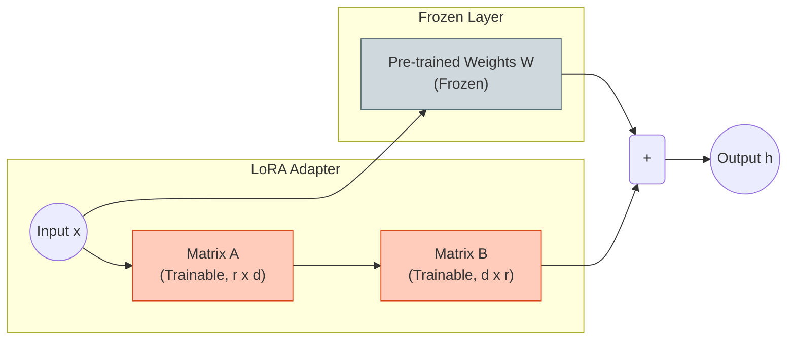

# LoRA (Low-Rank Adaptation)

**LoRA** is technically a fine-tuning method, but it's crucial for efficient deployment (e.g., serving many adapters on top of one base model).

## 1. Core Principle

Freeze the main weights $W \in \mathbb{R}^{d \times d}$ and introduce two trainable low-rank matrices $A \in \mathbb{R}^{r \times d}$ and $B \in \mathbb{R}^{d \times r}$, where rank $r \ll d$.
The update is:
$$ W' = W + \Delta W = W + \frac{\alpha}{r} (B \cdot A) $$

## 2. Key Hyperparameters

*   **Rank ($r$)**: The dimension of the low-rank bottleneck. Common values: 8, 16, 32, 64. Higher specificities might need higher rank, but research shows $r=4$ or $8$ is often enough for general SFT.
*   **Alpha ($\alpha$)**: Scaling factor. The update is scaled by $\alpha/r$. Usually set $\alpha \approx r$ or $\alpha = 2r$. It acts like a "learning rate" for the adapter influence.
*   **Target Modules**: Which layers to apply LoRA to?
    *   *Minimal*: `q_proj`, `v_proj` (Only attention query/value).
    *   *Standard*: `q_proj`, `k_proj`, `v_proj`, `o_proj` (All attention).
    *   *Full*: All linear layers (including MLP `gate_proj`, `up_proj`, `down_proj`). Generally yields best results.

## 3. QLoRA (Quantized LoRA)

QLoRA enables finetuning massive models on consumer hardware (e.g., Llama-3-70B on 2x3090).

*   **Mechanism**:
    1.  **4-bit Base Model**: The frozen weights $W$ are loaded in 4-bit NormalFloat (NF4).
    2.  **Double Quantization**: Quantization constants are themselves quantized to save even more memory.
    3.  **Paged Optimizers**: Offloading optimizer states to CPU RAM if GPU VRAM spikes.
*   **Inference**: A QLoRA model is just a 4-bit model + LoRA adapters. The performance is usually close to full 16-bit finetuning.

## 4. Serving LoRA

In inference systems (like vLLM or LoRAX):
*   **Multi-LoRA Serving**: You keep **one** shared frozen base model in VRAM.
*   **Dynamic Adapters**: Multiple users can query the same base model with different LoRA adapters (A for SQL, B for Chat, C for Coding).
*   **Overhead**: The adapters are tiny (<1% of model size), so switching them is negligible.
